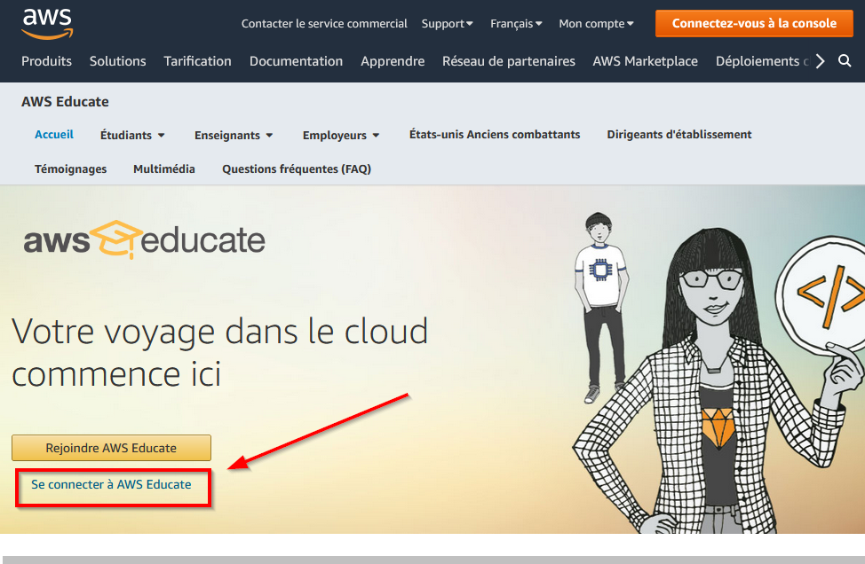
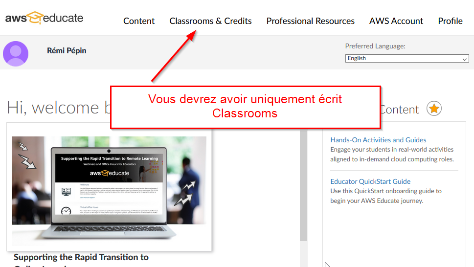
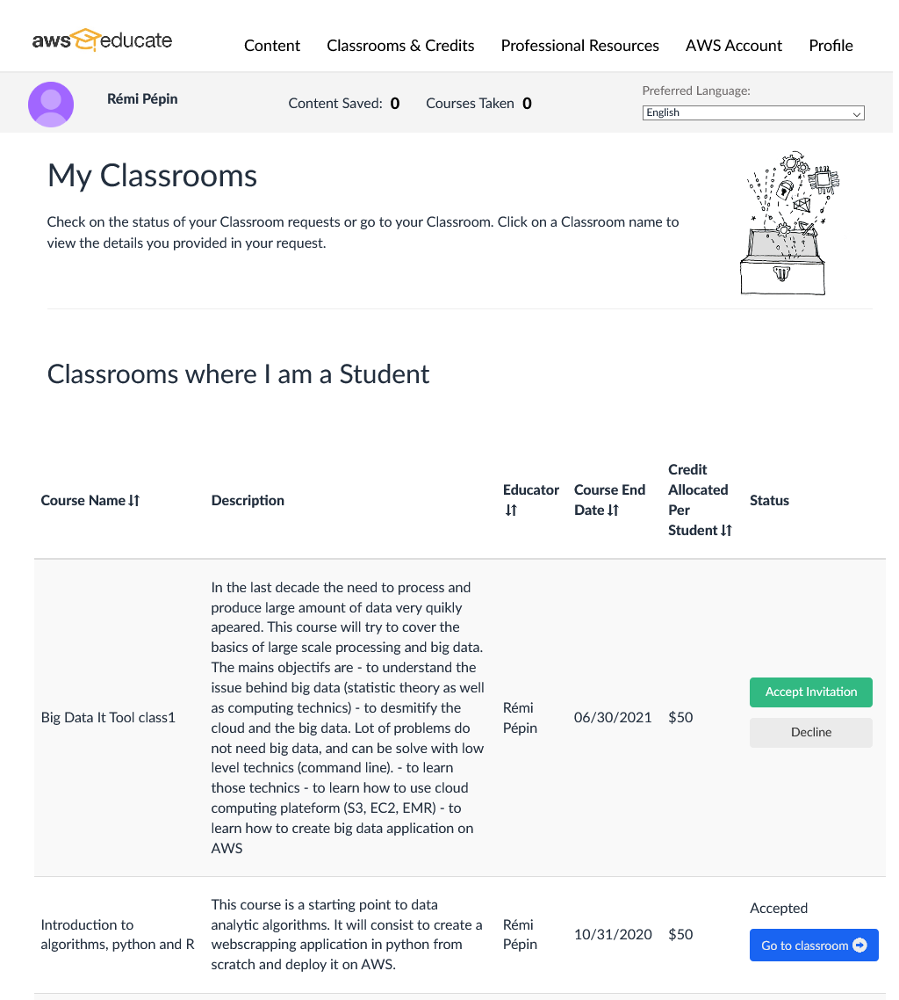
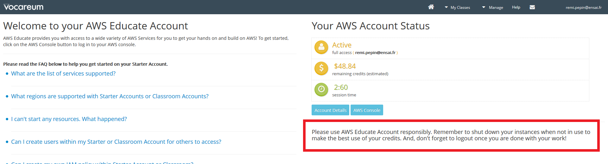

# Accéder à la console AWS pour les TP de big data

Rendez vous sur la plateforme [AWS educate](https://aws.amazon.com/fr/education/awseducate/)

Une fois connectez allez dans l'onglet `Classrooms`

Vous arriverez sur un écran similaire à celui-ci

Si vous n'avez pas accepter l'invitation acceptez là et la bouton passera au bleu et cliquez sur "Go to classroom"

Une pop up va s'afficher. Acceptez-la.

.png)

Vous serez ainsi redirigé vers "Vocareum", l'application tierce qui gère les "classrooms".

Enfin sur la dernière fenêtre, cliquez sur "AWS console". Cela vous redirigera vers la plateforme AWS. Il vous est rappelé d'utiliser le compte AWS qui vous est fourni de manière responsable. C'est à dire de penser à éteindre toutes les instances que vous créez une fois qu'elles ne sont plus utilisées.

Le compte AWS que vous allez utiliser pour les TP est localisé en Virginie du Nord. Ne changez pas cela ! Comme votre compte est à but purement scolaire, vous ne disposez pas de l'intégralité des services de la plateforme (vous n'avez pas accès aux information de facturation par exemple). De même votre compte est un compte généré par Vocareum, et vous ne pouvez pas y accéder sans passez par ce service. Il est donc inutile de le noter. Pour des connections futures à AWS dans le cadre scolaire, passez toujours par le portail AWS Educate, puis Vocareum. ·

## 