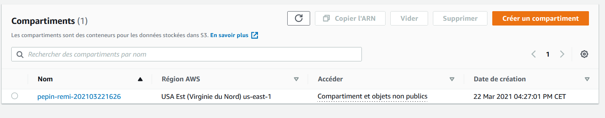
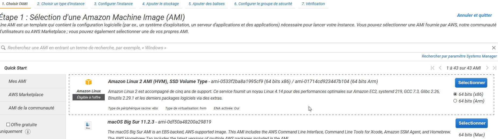
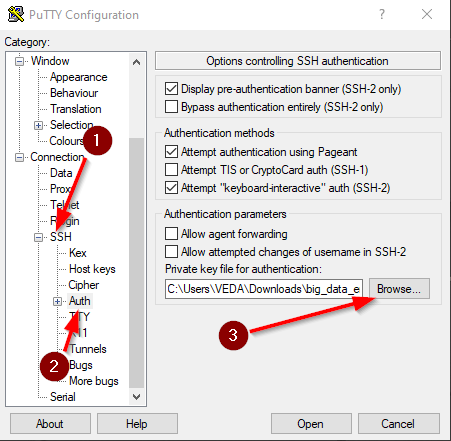
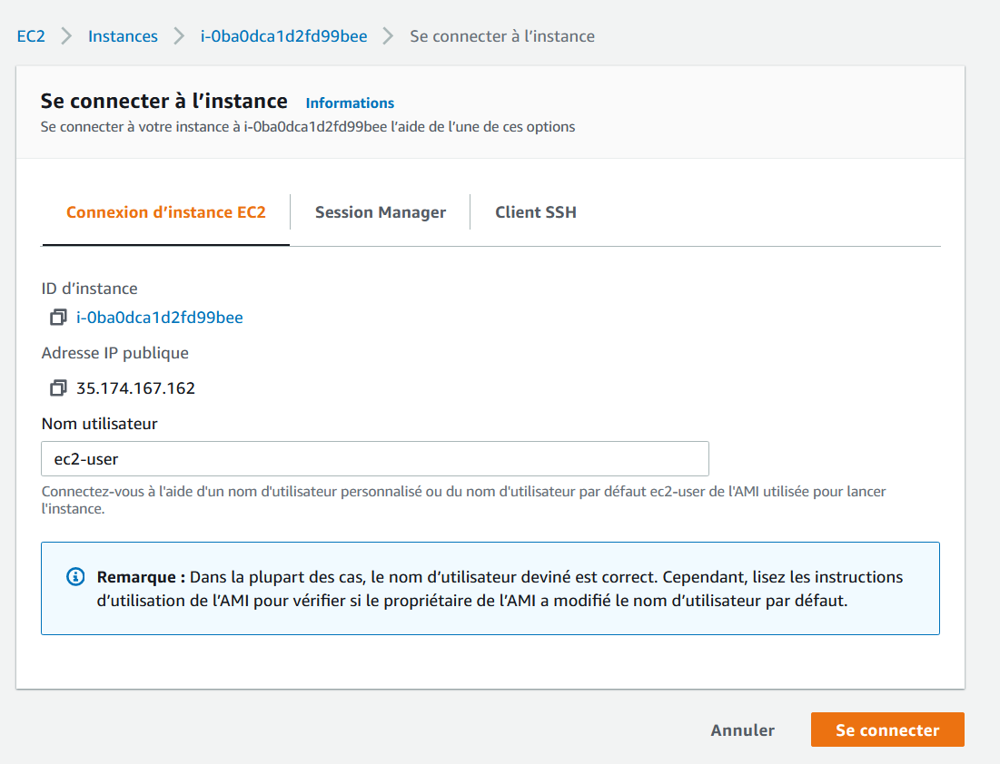

# TP 0 — Partie 1: Découverte de l'interface d'Amazon Web Service (AWS)

[TOC]

## Objectives

The lab's goal is to make you familiar with the AWS's interface. In this lab you will :

- Create an account on AWS academy if you haven't done yet
- Store some data on Amazon Simple Storage Service (AWS S3)
- Create an Elastic Compute Cloud instance (= a virtual machine) and connect to it with SSH

- Run some basic shell commands
  - `ls` to list files in a directory
  - `cd` to change the current directory 
  - `yum` to install a package
  - `aws s3 cp` to copy file from S3
  - `chmod` to change some file persmision
  - `time [commande]` to compute some execution time
- Shut down your EC2 instance

## 1. Log on AWS 

Follow the instructions you get from the AWS acamedy's e-mail, then those of the [AWS Academy Learner Lab - Student Guide ](https://foad-moodle.ensai.fr/pluginfile.php/22636/mod_resource/content/0/AWS%20Academy%20Learner%20Lab%20-%20Student%20Guide.pdf) to access to the AWS console.

Your AWS account is located in North Virginia, **do not change that**. Because your account is for academic purpose, your don't have access to all the AWS services. Your account is managed by AWS academy, so you have to use the AWS academy portal to access to your AWS account.


## 2. Exploration

In the `Services` tab, you should find for instance :

- EC2 in computation 
- S3 in storage
- A section for databases
- A section for _machine-learning_  
- A section for data analysis

## 3 Create a S3 bucket

**Amazon Simple Storage Service** (S3) is the standard solution to store data on AWS. Amazon assured a 99,999999999 % durability for your data. This mean, is you store 10 000 000 files on S3, you can on average expect to incur a loss of a single file every 10 000 years. 

The storage is quite expensive (around ~0,02 \$/Go/month), knowing that you pay for read operations (around ~0,09 \\$/Go). 1 To cost around 240\$ a year. For instance, a 1To SSD cost less than 100\$ (for a smaller durability), and a cloud storage solution (like drop box) for private individual cost 10\$/month for 2To (for the same durability). But the use case are different. S3 is for data access frequently by other AWS services. There is other storage solution (like S3 glacier) for archive, or databases.

All AWS services can natively read from and write to S3, if they have some access right. So, every application you deploy on AWS can import/export data from/to S3. A file stored in S3 is called an "object", and can be access by a unique URL. You can limit access right to a specific file. 

- [ ] In the search bar type `S3`
- [ ] 

- [ ] Click on `Créer un compartiment` ("bucket" in English)  
- [ ] Chose a unique name for your bucket (like ensai-firstName-lastName-currentDate)
- [ ] Keep all the default value, then create your bucket.

## 4. Import some files to your bucket

* [ ] Click on your bucket to go to its dedicated page.

  

- [ ] Click on `Charger`,and upload the lab0 zip file available on Moodle.


- [ ] One the upload finished, click on your file. You will land on the file page, and found to link to access to your file. One is the URL of the file, the other is the S3 URI. Copy in a text file your file URI, you will need it later.

  

## 5. SSH key creation

**SSH** (**S**ecure **SH**ell) protocol allow a secure remote connection to a machine. Moreover, with SSH you can control the remote machine. For more details, you can read this page [page web](https://doc.fedora-fr.org/wiki/SSH_:_Authentification_par_cl%C3%A9). But first you need a private key to authenticate yourself. 

- [ ] In the search bar, search `paire de clés`

- [ ] Click on `Créerune paire de clés`

- [ ] Give it a name (par ex: `labsuser`), select the ppk format if you use windows, and pem if you use Linux / macOs, then click on `créer`

- [ ] This will download your key, do not lost it ! 

- [ ] If you are on Linux / macOs open a terminal and type :

  ```
  cd ~/Downloads
  chmod 400 labsuser.pem
  ```

  Do not close this terminal

## 6. Create your first virtual machine

- [ ] In the search bar, search `EC2`

  

- [ ] Click on `Lancer une instance`

- [ ] First, you must choose an image for your machine (called AMI pour Amazon Machine Image). This image contain an OS and some default applications. Choose the first : Amazon Linux 2 AMI (HVM) - Kernel 5.10.

  

- [ ]  Then you will select the hardware configuration. For instance, for a general usage machine you can choose a `t2.micro` for a cheap but weak machine (0.012\$/hour, 1 core, 1Go Ram) or a more powerful and more expensive one like `t2.xlarge`  (0.188\$/hour, 8 core, 32Go Ram). Because you pay for how long your EC2 instance are up, turn off you machine at the end of the lab !

  

- [ ] On the next screen, select the AIM role `LabInstanceProfile`
  

- [ ] Then click on `Vérifier et lancer`

- [ ] Validate your instance

- [ ] Select the key pair

- [ ] Et voilà! Your VM is launching. Click on `Affichez les instances` and wait a minute!  

## 7. Connect to the EC2 instance

- [ ] Once your VM is running, you can access to the its administration page by clinking on its `id d'instance`

  

You will find many information, but the most important it's its  `IPv4 publique` which is its's IP address (Internet Protocol) used to access to your machine from outside AWS.

###  Windows user

- [ ] Run `PuTTY`

- [ ] In Host Name type your `public IP`

- [ ] In `Saved Session` enter `AWS EC2` and `Save`

  

- [ ] Then go to  `SSH` and find your .ppk file.

  

- [ ] Finally go back to the first screen, click on your session name,  `Save` then `Open` the session.

    

- [ ] A similar windows will pop up, click on `Oui`

  

- [ ] A terminal will open with  `login as:`. Type `ec2-user` then press `Enter`([documentation officielle](https://docs.aws.amazon.com/AWSEC2/latest/UserGuide/connection-prereqs.html))

    

  

### macOS/Linux user

- [ ] In the previously open terminal type

  ```
  ssh -i labsuser.pem ec2-user@[public-ip]
  ```

  Replace [public-ip] by your public ip


Tada ! your are connected to your virtual machine. **Although, this terminal is on your computer, every command you type are executed on the remote machine**. This make it possible to run huge computation without altering your own performance.  But, this machine do not have any graphical interface (GUI), so you need so basics of shell command.

## 8. Play with your VM

In this section you will learn some basics of shell, and reproduce the benchmark of language made in the first lesson. You will :

1. Get all the files for the benchmark
2. Install R and a python package on your machine
3. Run the benchmark

This benchmark compare the time to compute the max temperature for some year based on the USA weather data. Each file contains all the weather data for one year, and each record isa  weather observation. An observation looks like this :

```
0029029070999991901010106004+64333+023450FM-12+000599999V0202701N015919999999N0000001N9-00781+99999102001ADDGF108991999999999999999999
```

It's a positional file, with the temperature at the position [87, 91] and it's quality at position 91. In the example the temperature is -0078 deca Celsius (so -7.8°C), with a quality of 1 (a good quality). Each program loads line by line the data and computes the max by updating the current max value (so a $\mathcal{O}(n)$ in computation time and $\mathcal{O}(1)$ in memory) (expect for R that load all the data in memory so $\mathcal{O}(n)$ in memory). But each language has its specificities :

- python : dynamic typing, just in time compilation to byte code then interpreted by python
- java : static typing, ahead of time compilation to byte code then interpreted by java
- C : statis typing, ahead of time compilation to machine code then executed by the OS
- script bash :  no type like python/java/C, interpeted by your OS.

Here is some bash commands

| Command                        | Use                                                          |
| ------------------------------ | ------------------------------------------------------------ |
| sudo                           | Super user : basically you have all the rights               |
| cd [target_directory]          | Change directory : move in the file tree. To go to the parent directory do`cd ../` |
| ls                             | List : list all the file in the current directory            |
| mkdir [directory_name]         | Make directory : create a directory                          |
| rm [file_name]                 | Remove : remove a file. You cannot remove a none empty directory by default. You should use the `rm [file_name] -r`  to do so. Note : **NEVER** execute the command `rm -rf /` because you will remove all the file on the current machine |
| chmod 764 [file_name]          | Change mode : change the access right ofyour files. Without more detail, the access right 764 gives read, write and execution rights to the owner of the file. |
| unzip [file_name]              | Unzip : unzip files                                          |
| yum install [package]          | Package manager for some linux distribution. It's like pip but for Linux. |
| aws s3 cp [s3://URI]           | Specific AWS command. Copy file from s3 to the current machine |
| amazon-linux-extras  [package] | Like yum but for amazon machine.                             |

###  8.1 Benchmark setup

- [ ] Download the file stored on S3. Use the command `aws s3 cp [s3://object/uri] [output/folder]`.  The S3 URI is on S3 file page. For `output/folder` use the current directory with `.`. You should get a command and an output like this 

  ```
  [ec2-user@ip-172-31-85-99 ~]$ aws s3 cp s3://remi-pepin-21032022/fichiersTP0.zip .
  download: s3://remi-pepin-21032022/fichier TP.zip to ./fichier TP.zip
  ```

- [ ] With `ls` (*list*)  check you downloaded the file

- [ ] Now you will unzip your file with `unzip [nom de votre fichier]`. Check the result with `ls`

- [ ] For security reasons, you cannot execute your files. Do `chmod 764 get_data.sh awk.sh GetMaxTempC` to change that. For more details, the [chmod wikipedia page](https://fr.wikipedia.org/wiki/Chmod) provides more details..

- [ ] Now you will execute the `get_data.sh` script. Just type`./get_data.sh`.  This script download some data from the NOAA (~ météo france in the USA) server

### 8.2 Install R, java, C compiler and a python package

Your VM doesn't have all the require packages for the benchmark.

- [ ] **python-dev installation** : `python-devel` is require to create extension for python. To install it use  `yum`, a package manager for Linux. The exact command is`sudo yum install -y python3-devel.x86_64` (`sudo` to have super user right, `yum` to use the package manager, `install` to install a package, `-y` to validate the installation, and `python3-devel.x86_64` for the package name)

- [ ] **Java and GCC installation** : in the same way, insatall java and GCC with `sudo yum install java gcc -y`

- [ ] **Cython installation** : with `pip3`  install `Cython` and compile the Cython code:
  - [ ] `cd cython_code` for*change directory*  and go in the `cython_code` directory
  - [ ] `python3 setup.py` to run the compilation
  - [ ] `cd ../` to go back to the parent folder
- [ ] **R installation** :  to install R, you will use the amazon custome package manager `amazon-linux-extras`,  with the following command : `sudo amazon-linux-extras install R4 -y`.  Just wait 1-2 minutes.

### 8.3 Benchmark

Now it's time to run the benchmark. To do so, you will use the `time` command. `time` compute the execution time of the following command. For example : `time ./get_data.sh` . Write all the results, and compare then with the course. If results are different, try to understand why.

- [ ] To run compiled C or bash : `time ./[file]` 
- [ ] To run compiled java :`time java -jar [file.jar]`
- [ ] To run python :`time python3 [file.py]`
- [ ] To run R script : `time Rscript [filename.R]`

### 8.4 A shell in your web browser

- [ ] Close your terminal and go back to your EC2 instance page. Click on`Se connecter` then `Se connecter`
  
  Vous allez arriver sur une page similaire à celle ci-dessous. Cliquez sur `Se connecter`
  
  After 30 second you can use a  *cloud shell*. You can do the same thing with your cloud shell  as the previous SSH shell. 
- [ ] 

Type `ls` to check if your file are still there.

## 9. Shut down your machine

Because your EC2 instance is billed by time and not usage, once your work is done, shut down it. Although the cost is small, a small cost\*24\*7 for 1 week or running instance can cost 10\$. And for bigger machine in a company maybe 100\$ or 1000\$.

To shut down your machine, go to  `EC2 > Instances` and find all running instances. Click on `état de instance` then on `resilier l'isntance`.

