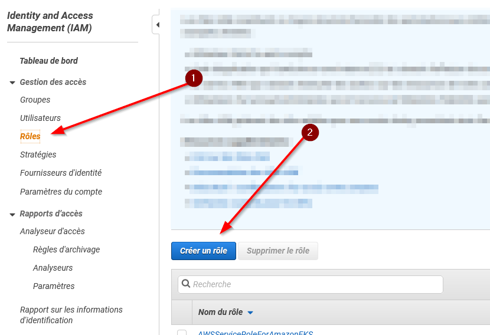
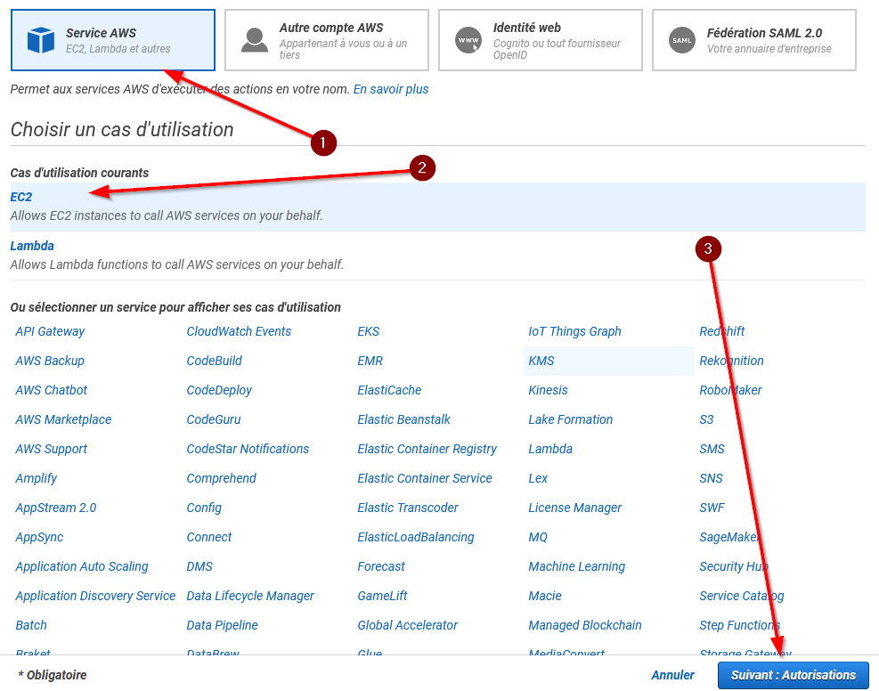
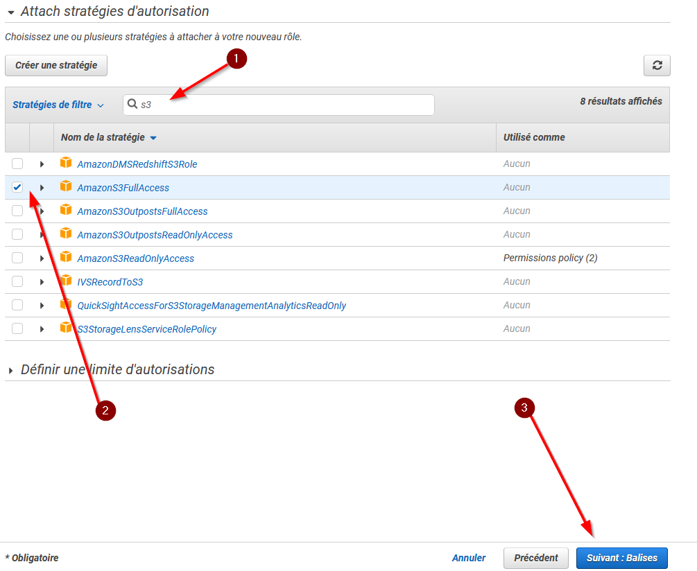
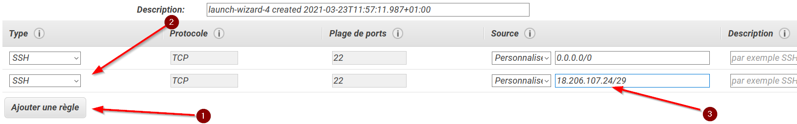

# TP 0 — Partie 1: Découverte de l'interface d'Amazon Web Service (AWS)

[TOC]

## Objectifs

Ce TP a pour but de vous familiariser avec l'interface d'Amazon Web Service (AWS). Pendant ce TP vous allez :

- Créer une compte AWS educate si ce n'est pas déjà fait
- Copier des données dans votre espace de stockage Amazon Simple Storage Service (S3)
- Lancer une machine virtuelle (VM) et s'y connecter
- Eteindre votre VM

## 1. Création du compte AWS Educate

Suivez les instructions à partir du mail AWS Educate reçu sur votre adresse ENSAI. Créez vous bien un "starter account". Cela vous permettra d'utiliser la plateforme AWS, mais sans jamais utiliser votre carte de crédit, et donc sans risque de devoir payer quoi que ce soit. Dans le processus de création, vous allez recevoir deux mails. Un premier pour vous demander de confirmer votre mail, un un second (qui arrivera quelques minutes plus tard) qui vous permettra de finaliser la création de votre compte. 

Une fois votre compte créé, connectez vous à la plateforme AWS Educate, et cliquez sur "Classroom & Credit" (*note : toutes les images proviennent d'un compte avec l"accès "Educator", il est possible que les interfaces ou que la marche à suivre soient un peu différentes.*)


Sur la page suivante cliquez sur "Go to classroom"

Une fenêtre va s'ouvrir, cliquez sur "Continue"

.png)

Vous serez ainsi redirigé vers "Vocareum", l'application tierce qui gère les "classrooms". Sélectionnez le bon cours. 


Enfin sur la dernière fenêtre, cliquzsur "AWS console". Cela vous redirigera vers la plateforme AWS. Il vous est rappelé d'utiliser le compte AWS qui vous est fourni de manière responsable. C'est à dire de penser à éteindre toutes les instances que vous créez une fois qu'elles ne sont plus utilisées.


Le compte AWS que vous allez utiliser pour les TP est localisé en Virginie du Nord. Ne changez pas cela ! Comme votre compte est à but purement scolaire, vous ne disposez pas de l'intégralité des services de la plateforme (vous n'avez pas accès aux information de facturation par exemple). De même votre compte est un compte généré par Vocareum, et vous ne pouvez pas y accéder sans passez par ce service. Il est donc inutile de le noter. Pour des connections futures à AWS dans le cadre scolaire, passez toujours par le portail AWS Educate, puis Vocareum. ·


## 2. Exploration

Dans l'onglet "Services", trouverez, entre autres :

- EC2, le service de calcul 
- S3, le service de calcul 
- La section dédiée aux bases de données 
- La section dédiée au _machine-learning_  
- La section dédiée à l'analyse de données 

## 3 Création d'un espace de stockage Amazon Simple Storage Service (S3)

**Amazon Simple Storage Service** (S3) est la solution de base que propose AWS pour stocker vos données de manière pérenne. Amazon dit assurer une durabilité de vos données de 99,999999999 %. Cela signifie que si vous stockez 10 000 000 objets avec Amazon S3, vous pouvez vous attendre à perdre en moyenne un objet unique une fois tous les 10 000 ans.

Ce stockage est assuré à coût relativement élevé (de l'ordre de ~0,02 \$/Go/mois), sachant que vous payez en sus les opérations de lecture (de l'ordre de ~0,09 \$/Go ; les écritures sont gratuites). 1 To de données vous coûte ainsi 240€ à l'année. Pour comparaison, un disque dur externe  SSD d'1 To coûte actuellement ~100€ (pour un durabilité moindre), et un cloud-storage (type dropbox) pour particulier coûte ~10€ / mois pour 2 To (pour une durabilité comparable). S3 est ainsi destiné à des données utilisées régulièrement par d'autres application hébergées par AWS. D'autres offres de stockage existent comme les archives, pour des données utilisées moins régulièrement, ou les bases de données.

Tous les services que vous propose AWS peuvent nativement lire depuis et écrire vers S3 si vous leur en donnée le droit. Ainsi, les programmes que vous exécutez, les données que vous traitez peuvent être importés/exportés dans S3. Chaque élément hébergé dans S3, appelé "objet", est accessible par une URL **unique**. Vous pouvez restreindre ou au contraire étendre les droits d'accès à vos objets.

- [ ] Dans la barre de recherche, cherchez "S3" et cliquez dessus


- [ ] Cliquez sur "Créer un compartiment" (en anglais un "bucket")  
- [ ] Choisissez un nom unique à votre compartiment (comme votre nom-prénom-et la date et heure du jour)
- [ ] Laissez toutes les valeurs par défaut et descendez en bas de la page pour créer votre compartiment 

## 4. Copie des données dans votre espace de stockage

* [ ] Cliquez sur le nom de votre compartiment pour allez sur sa page

  

- [ ] À partir du bouton `Charger", ajoutez un fichier (par exemple le fichier json que vous trouverez sur Moodle) à votre compartiment. Laissez toutes les valeurs par défaut.


- [ ] Une fois le chargement terminé cliquez sur votre fichier. Vous arriverez sur une page similaire avec les lien pour accéder à votre fichier. Aussi bien S3 que HTTP

  

## 5. Création d'un IAM, Identity and Access Management

Une grande partie de la gestion de la sécurité d'AWS se base sur les IAM et les rôles qu'ils possèdent. Actuellement si on ne fait rien il est impossible d'accéder à nos donnée sur S3 depuis une machine virtuelle (on appelle cette politique de liste blanche. On commente par tout interdire, et on ouvre manuellement les accès). Nous allons remédier à cela en créant un rôle qui permet d'accéder à S3. Bien que les écrans et options sont spécifique à AWS, cette notion de rôle avec des droits que l'on va appliquer à nos machines est centrale dans gestion de la sécurité dans le cloud computing 

- [ ] Dans la barre de recherche tapez `IAM`

- [ ] Puis allez dans `Rôles` et `Créer un rôle`

  

- [ ] Ensuite sélectionnez `Service AWS`, `EC2` et `Suivant`

  

- [ ] ​	Dans la barre de recherche cherchez `s3` puis sélectionnez `AmazonS3FullAccess`. Cela vous donnera tous les droits pour interagir avec votre stockage S3
  

- [ ] Ne définissez aucune balise et appuyez sur suivant

- [ ] Enfin donnez un nom à votre rôle, comme `Ec2_S3_fullAccess` puis créez le rôle.

## 6. Création d'une clef SSH

**SSH** (**S**ecure **SH**ell) permet de se connecter de façon sécurisée à un système Unix comme le cluster de l'Ensai qui est sous une distribution Linux. Pour plus d'information, je vous conseille de lire le début de cette [page web ](https://doc.fedora-fr.org/wiki/SSH_:_Authentification_par_cl%C3%A9)

- [ ] Dans la barre de recherche, cherchez "paire de clés" et cliquez dessus 
- [ ] Cliquez sur "Créer une paire de clés" 
- [ ] Donnez lui un nom (par ex: "ensai_big_data_TP"), sélectionnez le format PPK si vous utilisez une machine windows, et pem si vous utilisez une machine sous Linux / Mac Os, et cliquez sur "créer" 
- [ ] Cela va lancer le téléchargement d'un fichier, le perdez pas ! 

## 7. Création d'une machine virtuelle

- [ ] Dans la barre de recherche, cherchez "EC2" et cliquez dessus 

  

- [ ] Cliques sur `Lancer une instance`  

- [ ] Vous devez choisir l'image de la machine à créer appelé ici AMI pour *Amazon Machine Image*. Une image contient notamment le système d'exploitation. Choisissez la première: Amazon Linux 2 AMI.

  

- [ ]  Vous choisissez ensuite la configuration de VM. Par exemple, vous pouvez choisir une machine d'usage général à 1 cœurs `t2.micro` pour avoir une machine de faible puissance mais peu chère (0.012\$/heure) pour une machine plus puissante comme une `t2.xlarge`  (0.188\$/heure). Comme la facturation est au temps d'utilisation, pensez à éteindre vos machines à la fin du TP !

  

- [ ] Sur l'écran suivant sélectionnez votre IAM
  

- [ ] Validez cet étape et les 2 suivantes (stockage et balise)

- [ ] Sur l'écran des groupes de sécurité ajoutez une règle `SSH` avec la source `18.206.107.24/29`

  

  Ceci va rendre possible l'accès à votre machine via un *cloud shell* (un shell dans votre navigateur). Cette configuration est spécifique à AWS. Elle se trouve dans la [documentation officielle](https://docs.aws.amazon.com/AWSEC2/latest/UserGuide/ec2-instance-connect-set-up.html?icmpid=docs_ec2_console#ec2-instance-connect-setup-security-group) 

- [ ] Ensuite validez cette étape et la suivante

- [ ] Choisissez la bonne paire de clés

- [ ] Et voilà! Votre VM est en cours de lancement. Cliquez sur `Affichez les instances` et attendez quelques minutes !  

## 8. Connexion à sa VM

- [ ] Une fois l'instance lancée vous pouvez accéder à son écran d'administration en cliquant sur son `id d'instance`

  

Vous y trouverez de nombreuses informations, mais surtout l'adresse `IPv4 publique` qui est adresses IP (Internet Protocol) de votre machine pour y accéder en étant à l'extérieur de la plateforme AWS, par exemple depuis votre ordinateur.

- [ ] Lancez PuTTY

- [ ] Dans la partie `Host Name` saisissez adresse publique de votre serveur

- [ ] Dans la partie `Saved Session` rentrez le nom que vous voulez puis cliquez sur `Save`

  

- [ ] Puis allez dans le menu `SSH` et chargez votre fichier .ppk

  

  - [ ] Enfin retournez dans l'écran initial, cliquez sur le nom de la session puis sur `Save` pour sauvegarder votre configuration. Lancez la session SSH.

    

- [ ] Une fenêtre semblable va s'ouvrir pour vous prévenir que c'est la première fois que vous vous connectez à cette machine et si vous lui faites confiance. Vous allez cliquer sur `Oui`

  

  - [ ] Un terminal va s'ouvrir avec écrit `login as:`. Saisissez `ec2-user` puis validez ([documentation officielle](https://docs.aws.amazon.com/AWSEC2/latest/UserGuide/connection-prereqs.html))

    

  - [ ] Voilà vous venez de vous connecter à votre machine virtuelle. **Bien que visuellement le terminal se trouve sur votre écran, tout ce que vous allez exécuter dans se terminal sera réalisé sur une machine distante**. Vous pouvez ainsi réaliser de calculs très longs et nécessitant une grande puissance de calcul sur une machine puissance depuis votre ordinateur. Par contre cette machine n'a pas d'interface graphique (GUI : *graphical user interface*) et va nécessiter de connaitre quelques rudiments de *bash*.

## 9. Jouer avec sa VM

- [ ] Lancez python avec la commande `python`. Cela ouvre un *shell* python, similaire à la console IPython de Spyder. Vous pouvez essayer ce petit code

  ```python
  def fibo(n):
       if n==1 or n==0:
               return 1
       else :
               return fibo(n-1) + fibo(n-2)
          
  
  fibo(5)
  ```

  Pour quitter le *shell* python appuyez sur `ctrl+D`

  Si le *shell* python n'a pas que peu d'intérêt, cela signifie que vous avez un interpréteur python sur cette machine. Ainsi vous pouvez lancer un code python en faisant `python votre_fichier.py`

- [ ] R n'est pas par défaut installé. Vous pouvez l'installer en saisissant la ligne de commande suivante : `sudo amazon-linux-extras install R4`. Quand l'installation vous demandera si vous voulez vraiment installer ce package appuyez sur `y`. Le terminal va se remplir de texte pendant quelques minutes n'y prêtait pas attention, c'est juste la machine qui vous dit ce qu'elle fait. Ensuite pour lancer R vous devez seulement saisir`R` dans votre terminal.

- [ ] Vous pouvez également télécharger des fichier stockez sur S3. Pour ce faire vous allez saisir la ligne suivante :
  `aws s3 cp uri_s3_de_votre_fichier .` (il y a bien un point à la fin de la commande) en remplaçant `uri_s3_de_votre_fichier` par  la valeur contenu dans URI s3 sur l'écran de votre fichier sur S3

  
  Cela devrait produire un résultat similaire à celui-ci

  ```
  [ec2-user@ip-172-31-82-150 ~]$ aws s3 cp s3://pepin-remi-202103221626/rule20210219-184802.jsonl .
  download: s3://pepin-remi-202103221626/rule20210219-184802.jsonl to ./rule20210219-184802.jsonl
  ```

- [ ] Fermez votre terminal et retournez sur la page de votre instance EC2. Nous allons maintenant nous y connecter via un *cloud shell*. Pour ce faire cliquez sur `Se connecter`
  
  Vous allez arriver sur une page similaire à celle ci-dessous. Cliquez sur `Se connecter`
  
  Après quelques instants vous allez arriver sur votre *cloud shell*

- [ ] 

Depuis cette écran vous êtes connecté à votre machine distante. Par exemple tapez la commande suivante `ls` (*list* permet de lister les fichiers dans un dossier). Cela va afficher le nom de votre fichier. Ensuite faites `cat le_nom_de_votre_fichier` (vous avez de autocomplétions avec la touche tabulation; `cat` signifie *concatenate*) pour afficher votre fichier.

## 10. Eteindre sa VM

Le coût d'une VM est fonction de son temps d'utilisation, pas du travail qu'il accomplit. Ainsi, une fois le travail effectué, vous _devez_ éteindre vos VMs ! **Même si le coût horaire est bas, faire tourner une machine EC2 pendant 1 semaine se chiffre en dizaines d'euros!**

Pour éteindre votre VM, allez sur la page d'accueil `EC2 > Instances` en cours d'exécution ou sur la bar de navigation `Instances > Instances`, enfin `Etat de l'instance`. Selon le type d'instance, vous pouvez l'arrêter (**EN:** _stop_, pour la réutiliser plus tard), ou la résilier (**EN:** _terminate_, i.e. la supprimer). Dans les deux cas, les données en mémoire et le stockage local sont perdus, mais dans le premier cas, la configuration (URL et IP) sont conservés.

