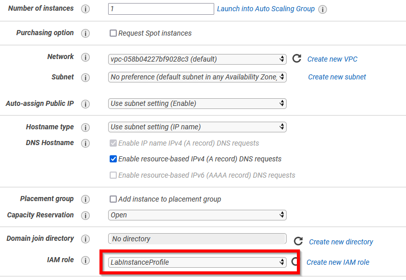

# TP 0 — Partie 1: Découverte de l'interface d'Amazon Web Service (AWS)

[TOC]

## Objectifs

Ce TP a pour but de vous familiariser avec l'interface d'Amazon Web Service (AWS). Pendant ce TP vous allez :

- Créer une compte AWS educate si ce n'est pas déjà fait
- Copier des données dans votre espace de stockage Amazon Simple Storage Service (S3)
- Lancer une machine virtuelle (VM) et s'y connecter en SSH.
- Exécuter différentes commandes de base 
  - `ls` pour lister les documents dans un dossier
  - `cd` pour change directory pour naviguer dans une arborescence de fichiers
  - `yum` pour installer un package
  - `aws s3 cp` pour copier des fichiers depuis S3
  - `chmod` pour changer les permissions d'un fichier
  - `time [commande]` pour mesurer la temps d'exécution d'une commande

- Eteindre votre VM

## 1. Création du compte AWS Academy 

Suivez les instructions à partir du mail AWS Academy reçu sur votre adresse ENSAI pour créer votre compte si ce n'est pas fait, puis celles du fichier [AWS Academy Learner Lab - Student](https://foad-moodle.ensai.fr/pluginfile.php/22636/mod_resource/content/0/AWS%20Academy%20Learner%20Lab%20-%20Student%20Guide.pdf) Guide pour accéder à la console AWS.

Le compte AWS que vous allez utiliser pour les TP est localisé en Virginie du Nord. Ne changez pas cela ! Comme votre compte est à but purement scolaire, vous ne disposez pas de l'intégralité des services de la plateforme (vous n'avez pas accès aux information de facturation par exemple). De même votre compte est un compte généré par aws academy, et vous ne pouvez pas y accéder sans passer par ce service.  Pour des connexions futures à AWS dans le cadre scolaire, passez toujours par le portail AWS academy.


## 2. Exploration

Dans l'onglet "Services", trouverez, entre autres :

- EC2, les services de calcul 
- S3, les services de calcul 
- La section dédiée aux bases de données 
- La section dédiée au _machine-learning_  
- La section dédiée à l'analyse de données 

## 3 Création d'un espace de stockage Amazon Simple Storage Service (S3)

**Amazon Simple Storage Service** (S3) est la solution de base que propose AWS pour stocker vos données de manière pérenne. Amazon dit assurer une durabilité de vos données de 99,999999999 %. Cela signifie que si vous stockez 10 000 000 fichiers avec Amazon S3, vous pouvez vous attendre à perdre en moyenne un objet unique une fois tous les 10 000 ans.

Ce stockage est assuré à coût relativement élevé (de l'ordre de ~0,02 \$/Go/mois), sachant que vous payez en sus les opérations de lecture (de l'ordre de ~0,09 \$/Go ; les écritures sont gratuites). 1 To de données vous coûte ainsi 240€ à l'année. Pour comparaison, un disque dur externe  SSD d'1 To coûte actuellement ~100€ (pour un durabilité moindre), et un cloud-storage (type dropbox) pour particulier coûte ~10€ / mois pour 2 To (pour une durabilité comparable). S3 est ainsi destiné à des données utilisées régulièrement par d'autres application hébergées par AWS. D'autres offres de stockage existent comme les archives, pour des données utilisées moins régulièrement, ou les bases de données.

Tous les services que vous propose AWS peuvent nativement lire depuis et écrire vers S3 si vous leur en donnée le droit. Ainsi, les programmes que vous exécutez et les données que vous traitez peuvent être importés/exportés dans S3. Chaque élément hébergé dans S3, appelé "objet", est accessible par une URL **unique**. Vous pouvez restreindre ou au contraire étendre les droits d'accès à vos objets.

- [ ] Dans la barre de recherche, cherchez "S3" et cliquez dessus


- [ ] Cliquez sur "Créer un compartiment" (en anglais un "bucket")  
- [ ] Choisissez un nom unique à votre compartiment (comme votre nom-prénom et la date et heure du jour)
- [ ] Laissez toutes les valeurs par défaut et descendez en bas de la page pour créer votre compartiment 

## 4. Copie des données dans votre espace de stockage

* [ ] Cliquez sur le nom de votre compartiment pour aller sur sa page dédiée

  

- [ ] À partir du bouton `Charger`, ajoutez le fichier zip du lab0 disponible sur Moodle.


- [ ] Une fois le chargement terminé cliquez sur votre fichier. Vous arriverez sur une page similaire avec le lien pour accéder à votre fichier. Aussi bien S3 que HTTP faire différence entre s3 et http

  

## 5. Création d'une clef SSH

**SSH** (**S**ecure **SH**ell) permet de se connecter et contrôler de façon sécurisée un système Unix distant comme le cluster de l'Ensai ou une machine hébergée sur AWS. Pour plus d'information, je vous conseille de lire le début de cette [page web](https://doc.fedora-fr.org/wiki/SSH_:_Authentification_par_cl%C3%A9).

- [ ] Dans la barre de recherche, cherchez "paire de clés" et cliquez dessus 
- [ ] Cliquez sur "Créer une paire de clés" 
- [ ] Donnez lui un nom (par ex: "ensai_big_data_TP"), sélectionnez le format PPK si vous utilisez une machine windows, et pem si vous utilisez une machine sous Linux / Mac Os, et cliquez sur "créer" 
- [ ] Cela va lancer le téléchargement d'un fichier, ne le perdez pas ! 

## 6. Création d'une machine virtuelle

- [ ] Dans la barre de recherche, cherchez "EC2" et cliquez dessus 

  

- [ ] Cliquez sur `Lancer une instance`  

- [ ] Vous devez choisir l'image de la machine à créer appelé ici AMI pour *Amazon Machine Image*. Une image contient notamment le système d'exploitation. Choisissez la première: Amazon Linux 2 AMI (HVM) - Kernel 5.10.

  

- [ ]  Vous choisissez ensuite la configuration de VM. Par exemple, vous pouvez choisir une machine d'usage général à 1 cœurs `t2.micro` pour avoir une machine de faible puissance mais peu chère (0.012\$/heure) pour une machine plus puissante comme une `t2.xlarge`  (0.188\$/heure). Comme la facturation est au temps d'utilisation, pensez à éteindre vos machines à la fin du TP !

  

- [ ] Sur l'écran suivant sélectionnez pour le rôle IAM `LabInstanceProfile`
  

- [ ] Puis cliquez sur `Vérifier et lancer`

- [ ] Ensuite validez la création de l'instance.

- [ ] Choisissez la bonne paire de clés

- [ ] Et voilà! Votre VM est en cours de lancement. Cliquez sur `Affichez les instances` et attendez quelques minutes !  

## 7. Connexion à sa VM

- [ ] Une fois l'instance lancée vous pouvez accéder à son écran d'administration en cliquant sur son `id d'instance`

  

Vous y trouverez de nombreuses informations, mais surtout l'adresse `IPv4 publique` qui est adresses IP (Internet Protocol) de votre machine pour y accéder en étant à l'extérieur de la plateforme AWS, par exemple depuis votre ordinateur.

- [ ] Lancez PuTTY

- [ ] Dans la partie `Host Name` saisissez adresse publique de votre serveur

- [ ] Dans la partie `Saved Session` rentrez le nom que vous voulez puis cliquez sur `Save`

  

- [ ] Puis allez dans le menu `SSH` et chargez votre fichier .ppk

  

  - [ ] Enfin retournez dans l'écran initial, cliquez sur le nom de la session puis sur `Save` pour sauvegarder votre configuration. Lancez la session SSH.

    

- [ ] Une fenêtre semblable va s'ouvrir pour vous prévenir que c'est la première fois que vous vous connectez à cette machine et si vous lui faites confiance. Vous allez cliquer sur `Oui`

  

  - [ ] Un terminal va s'ouvrir avec écrit `login as:`. Saisissez `ec2-user` puis validez ([documentation officielle](https://docs.aws.amazon.com/AWSEC2/latest/UserGuide/connection-prereqs.html))

    

  - [ ] Voilà vous venez de vous connecter à votre machine virtuelle. **Bien que visuellement le terminal se trouve sur votre écran, tout ce que vous allez exécuter dans ce terminal sera réalisé sur une machine distante**. Vous pouvez ainsi réaliser des calculs très longs et nécessitant une grande puissance de calcul sur une machine puissance depuis votre ordinateur. Par contre cette machine n'a pas d'interface graphique (GUI : *graphical user interface*) et va nécessiter de connaitre quelques rudiments de *bash*.

## 8. Jouer avec sa VM

Le but de cette section es de vous faire manipuler quelques commandes de base en bash et de reproduire un benchmark des langages comme fait en cours. Vous allez :

1. Récupérer tous les fichiers nécessaires au benchmark
2. Installer R et un package pour python
3. Réaliser le benchmark.

Pour rappel ce benchmark se base sur le calcul de la température max annuelle à partir des données météo étatsunienne. Chaque fichier contient les données d'une année, avec chaque ligne contenant les données d'une mesure. Les différents programmes font tous la même chose, ils lisent les fichiers pour extraire la température maximum et l'afficher. Mais chaque langage à ses spécificités :

- python : langage typé dynamiquement, compilé à la volée puis interprété python
- java : langage typé statiquement, compilé en byte code à l'avance puis interprété par java
- C : langage typé statiquement, compilé en code machine à l'avance puis exécuté
- script bash :  pas de notion au sens python/java/C, interprété par votre OS. 

###  8.1 Mise en place des fichiers du TP 

- [ ] Téléchargez vos fichiers stockés sur S3. Pour ce faire vous allez saisir la commande suivante `aws s3 cp [s3://object/uri] [output/folder]`.  Pour récupérer l'URI de votre objet S3, allez sur la page de votre objet et cliquez sur "Copier l'URI S3". Pour `output/folder`, vous allez utiliser le répertoire courant avec un `.`. Vous devriez obtenir une commande et un sortie similaire à celle-ci :

  ```
  [ec2-user@ip-172-31-85-99 ~]$ aws s3 cp s3://remi-pepin-21032022/fichiersTP0.zip .
  download: s3://remi-pepin-21032022/fichier TP.zip to ./fichier TP.zip
  ```

- [ ] Avec la commande `ls` (*list*) vérifiez que vous avez bien téléchargé les fichiers sur S3 dans le répertoire courant.

- [ ] Vous allez maintenant extraire les fichiers de l'archive avec la commande `unzip [nom de votre fichier]`. Vérifiez que cela à bien fonctionné avec la commande `ls`

- [ ] Pour des raisons de sécurité, vos fichiers ne peut être exécuté pour le moment. Utilisez la commande

  `chmod 764 get_data.sh awk.sh GetMaxTempC`

  Pour les rendre exécutable. Pour plus de détails sur la autorisation et la commande chmod (*change mode*) la page [wikipedia](https://fr.wikipedia.org/wiki/Chmod) est une bonne documentation.

- [ ] Maintenant que vous avez vos fichiers, vous allez exécuter le script `get_data.sh`. Pour ce faire tapez `./get_data.sh`.  Ce script va récupérer les fichier depuis les serveurs de la NOAA (= météo France étatsunienne) et les mettre en forme pour le TP.

### 8.2 Installer R et un package python

La machine virtuelle que vous avez crée ne dispose pas tous les programmes nécessaires au benchmark.

- [ ] **Installation de python-dev** : `python-devel` est nécessaire pour créez des extension python. Pour l'installer, vous allez utiliser `yum`, un gestionnaire de packages pour certaines distributions linux (un équivalent au `apt` d'ubuntu). La commande à utiliser est `sudo yum install -y python3-devel.x86_64` (`sudo` pour dire que vous exécuter la commande en super user, `yum` pour dire que vous utiliser le gestionnaire de package, `install` pour dire que vous voulez installez un package, `-y` pour valider l'installation, et `python3-devel.x86_64` le nom du package)
  - [ ] Installez `Cython` avec `pip3 ` et compilez le code cython en faisant :
    - [ ] `cd cythond_code` pour *change directory* qui permet de se déplacer dans votre arborescence
    - [ ] `python3 setup.py` pour lancer la compilation
    - [ ] `cd ../` pour retourner dans la dossier parent.

- [ ] **Installation de R** : pour l'installer R vous allez utiliser le gestionnaire de package d'amazon `amazon-linux-extras`,  avec la ligne de commande suivante : `sudo amazon-linux-extras install R4 -y`.  Le terminal va se remplir de texte pendant quelques minutes n'y prêtez pas attention, c'est juste la machine qui vous dit ce qu'elle fait. 

### 8.2 Benchmark des langages

Dans cette partie vous allez reproduire l'expérience du cours consistant à tester la vitesse de traitement de différents langages. Cela va se faire essentiellement avec la commande `time`. La commande `time` permet de mesurer la temps d'exécution d'une commande passer en argument. Exemple `time chmod 764 get_data.sh` permet de mesurez le temps nécessaire pour pour changer les permission du fichier get_data.sh. Notez chacun des résultats et vérifiez qu'ils sont cohérents avec ceux du cours. Si ce n'est pas les cas, essayez de comprendre pourquoi.

- [ ] Pour lancer le code C compilé et le script bash vous devez faire `time ./[file]` 
- [ ] Pour lancer le code java compilé en jar vous devez utiliser la commande `time java -jar [file.jar]`
- [ ] Pour les codes python utilisez la commande `time python3 [file.py]`
- [ ] Pour lancer un script R vous devez saisir `time Rscript [filename.R]` dans votre terminal.

### 8.3 Un shell dans le navigateur

- [ ] Fermez votre terminal et retournez sur la page de votre instance EC2. Nous allons maintenant nous y connecter via un *cloud shell*. Pour ce faire cliquez sur `Se connecter`
  
  Vous allez arriver sur une page similaire à celle ci-dessous. Cliquez sur `Se connecter`
  
  Après quelques instants vous allez arriver sur votre *cloud shell*
- [ ] 

Depuis cette écran vous êtes connecté à votre machine distante. Par exemple tapez la commande suivante `ls` pour voir que vous avez bien vos fichiers, puis tentez de les réexécuter.

## 9. Eteindre sa VM

Le coût d'une VM est fonction de son temps d'utilisation, pas du travail qu'il accomplit. Ainsi, une fois le travail effectué, vous _devez_ éteindre vos VMs ! **Même si le coût horaire est bas, faire tourner une machine EC2 pendant 1 semaine se chiffre en dizaines d'euros!**

Pour éteindre votre VM, allez sur la page d'accueil `EC2 > Instances` en cours d'exécution ou sur la bar de navigation `Instances > Instances`, enfin `Etat de l'instance`. Selon le type d'instance, vous pouvez l'arrêter (**EN:** _stop_, pour la réutiliser plus tard), ou la résilier (**EN:** _terminate_, i.e. la supprimer). Dans les deux cas, les données en mémoire et le stockage local sont perdus, mais dans le premier cas, la configuration (URL et IP) sont conservés.

