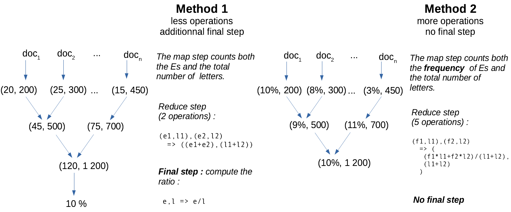

In this tutorial, we are going to perform exploratory and explanatory analyses of a massive dataset consisting in hundreds of thousands of AirBnB listings, as made available by the Inside AirBnB project [here](http://insideairbnb.com/get-the-data.html). Rémi Pépin has loaded a lot these listings on AWS at this address: `s3://spark‑lab‑input‑data‑ensai20212022/airbnbb/`

## A. Tutorial setup (1/2)

Section B is purposefully independent from section A. So while you wait for your cluster to launch, you can start the tutorial!

### ACTIONS

⚙️ **A1.** On AWS, use the EMR service to launch a notebook backed by a Spark cluster.

## B.  How to distribute elementary statistical tasks?

**The map and reduce principle**

When your data is distributed, i.e is spread out across multiple hard disks / memories on different logical or physical machines, it is clearly not possible to load everything in memory to perform some computation. (No computer from the cluster would have enough storage space / memory space to load the full data set, and the exchange of information _between_ the nodes of the cluster would take considerable amounts of time.) What can you do then?

A surprisingly satisfying situation is when your algorithm can be expressed in a **map-and-reduce model**[^mapreduce]. A **map** step, in computer science, is the equivalent a function in mathematics: from a given entry, return an output. Examples include counting the number of occurrences of a word in a text, squaring some number, subtracting some number, etc.  A **reduce** step takes two inputs and produces one input, and can be called recursively onto its own outputs, progressively yielding the final result through a pyramid of **accumulators** (see diagram here under). Popular reduce functions include (pairwise) concatenation of character strings, (pairwise) product, (pairwise) minimum and (pairwise) maximum. But **pairwise addition** is probably the most used reduce function, with the aim goal of performing a complete addition:

[^mapreduce]: Hadoop's MapReduce is the name of what was to become today Apache Spark. The persons behind this framework were among the first to advocate for the map-and-reduce mode in order to achieve efficient parallelisation. Unfortunately, the similarity of the names causes a lot of confusion between the map-and-reduce theoretical model and the concrete Hadoop implementation. I will use "map-and-reduce" to help distinguish the algorithmic concept from the MapReduce program, but this is _not_ standard in the literature.


**Why is the map-and-reduce scheme so interesting?**  Well, say you have $n$ entries and $k$ worker nodes at your disposal. The map operation can always be performed locally on each node, since the transformation does not depend on the rest of the data set. This is an **embarrassingly parallel problem** and we roughly divide the execution time by $k$. Then, most of the reduce steps can also happen on the worker nodes, until the local data has been completely summarized. This also an $k$_fold acceleration! Then, there remains only $k$ reduce steps, and since $k \ll n$, this is usually quite negligible, even though the (potentially high) networking costs happen at this step. There is still some cost of task coordination and data exchange, but this usually small compared to the costs of parallelisation.


**The reduce step**

**A reduce function is an associative function** $f: E \times E \mapsto E$, where associativity means $\forall (a,b,c) \in E^3, f(a,f(b,c))=f(f(a,b),c)$. This is required because the distribution of data blocks across the nodes is random, and that we want to minimize data transmission between the nodes.

Moreover, **$f$ may or may not be commutative**, in the sense that $f(a,b)=f(b,a)$. If it is the case, such as with addition and multiplication, then the computing may happen in no particular order. This means that the central node need not wait for some partial results to be returned by a belated node. On the contrary, if $f$ is not commutative, (a) the worker nodes must apply the function in a defined order, (b) the central node needs to reduce the intermediate outputs in a defined order, (c) it may have to delay the final reduce steps because of a lingering node.

The reduce function must not be defined on $E=\mathbb{R}$. For instance, in the context where data is a collection of text documents, a word-count function may return accumulator objects looking like: `((word1,count1), (word2,count2))`. Also, the accumulators — that is, the outputs of the each intermediate reduce step — are not necessarily exactly the cumulative version of the final statistic our algorithm outputs! Rather, **accumulators are information-dense, fast-to-compute summary statistics** from which the required final statistics can be obtained.

Imagine you want to count the frequency of the vocal E in English, given a collection of texts. It is faster to count the number of Es as well as the total number of characters than to accumulate directly the frequencies, as shown in this diagram:



**Online algorithms**

An **online algorithm** is an algorithm with an inner state that can be actualized at low cost for any new arrival of data. A good metaphor is track-keeping of the number of people on a bus: every time a person enters or leaves, you apply ±1 to the count, without the need to systematically recount everyone. Said otherwise, an online algorithm is any algorithm whose last result can be actualized from new data, at a smaller cost than an alternative algorithm that uses both old and new data from scratch.

It turns out that **respecting the map-and-reduce model gives us online algorithms for free**, where the **inner state** of the algorithm is the output from the last reduce call. Indeed, writing $s_\text{old}$ and $s_\text{new}$ the old and new states (the old and new summary statistics), and $x_new$ the latest data point, we have:

$$s_\text{new}=\text{reduce}(s_\text{old}, \text{map}(x_\text{new}))$$

Thus, writing an algorithm following the map-and-reduce model gives you both a parallelized batch algorithm and a stream algorithm at once.

**Number of passes**

So far we have discussed algorithms that require only one map and one reduce functions. But for some statistics, it is not sufficient. For instance, if we want to count the number of texts where the letter E is more common than average, we first have to compute the average frequency in a first pass, then to count the texts where the frequency exceed this number with a second one. We can NOT do this in only one run, since the global average frequency is not known !

Each run is called a **pass** and some algorithms require several passes.

**Limits**

- Not all statistical algorithms can be expressed according to the map-and-reduce algorithm, and when they can, it may require a significant re-writing compared to the standard algorithms.
- There may be a trade-off between the number of passes, the speed of each map / reduce steps and the volume of data transferred between each reduce step.

### QUESTIONS

💡 **Q1.** You are given `errors`, a distributed vector of prediction errors. Write a map-and-reduce algorithm for computing the **total sum of squares**. _(You may want to create a Python version of this algorithm, using the `map(function, vector)` and `reduce(function, vector)` functions. `reduce` lives in the `functools` module. You may use lambda-functions.)_

<!--
```
map :          e -> e^2
reduce : (s1,s2) -> s1+s2
```

```python
from functools import reduce
reduce(lambda s1, s2: s1+s2, map(lambda e: e**2, errors))
```
-->

💡 **Q2.** Write **two** different map-and-reduce algorithm for computing the **_mean_ sum of squares**. _(One may include a final $O(1)$ step.)_

<!--
```
map :               e -> {m=e^2, w=1}
reduce : (obj1, obj2) -> {
    m = (obj1.m * obj1.w + obj2.m * obj2.w) / (obj1.w + obj2.w),
    w = obj1.w + obj2.w
)
```
```python
from functools import reduce
def weighted_mean(obj1, obj2):
  w = obj1["w"] + obj2["w"]
  return ({
      "m" : (obj1["m"] * obj1["w"] + obj2["m"] * obj2["w"]) / w,
      "w" : w
  })
squared_errors = map(lambda e: {"m" : e**2, "w" : 1}, errors)
reduce( weighted_mean, squared_errors )
```
... or:

```
map :               e -> {s=e^2, n=1}
reduce : (obj1, obj2) -> {
    s = obj1.s + obj2.s,
    n = obj1.n + obj2.n
final_step : s/n
```
```python
from functools import reduce

def sum_and_n(obj1, obj2) :
  return {
    "sum" : obj1["sum"] + obj2["sum"],
    "n"   : obj1["n"] + obj2["n"]
  }

squared_errors = map(lambda e: {"sum" : e**2, "n" : 1}, errors)
total_sum_and_n = reduce( sum_and_n, squared_errors )
total_sum_and_n["sum"]/total_sum_and_n["n"]
```
-->

💡 **Q3.** Imagine you have a cluster consisting into one central node and two executor nodes, with local data already available. Let us assume that each executor node holds blocks representing approximately half of the `errors` vector. The executors perform as many of the map and reduce steps they can from the mean-computing algorithm from (**Q2.**). Then the central node elects one of the two executors to perform the remaining reduce steps. How much data has been transferred **between** the nodes? Is this susceptible to slow down the algorithm?

<!--
Almost nothing:
assume executor 1 was elected for the final reduce step
executor 2 reduces all its data to a single {sum,n} object and sends the object to executor 1
executor 1 performs the final reduce step then sends it to central node

The data transfer is not susceptible to slow down the algorithm. But there is an overhead from organizing the tasks across the cluster!
-->

💡 **Q4** Is the median easy to write as a map-and-reduce algorithm? Why?

<!-- Exact median computation is not readily decomposable into a map-and-reduce algorithm, because the full set of numbers is needed in order. Parallel algorithm exist for the median, using the pivot technique. This is beyond the scope of this tutorial. -->

💡 **Q5** Given a (distributed) series of numbers, the variance can be straightforwardly expressed as a two-pass algorithm: (a) in a first pass, compute the mean, then (b) in a second pass, compute the mean of the errors to the mean. Can it be expressed as a one-pass only algorithm? Is it more expensive to compute variance *and* mean instead of the variance alone?

<!-- Yes, using the fact that V(X)=E((X-E(X))^2)=E(X^2)-E(X)^2. E(X) and E(X^2) can be computed during the same reduce map:

map :               x -> {s1=x, s2=x^2, n=1}
reduce : (obj1, obj2) -> {
    s1 = obj1.s1 + obj2.s1,
    s2 = obj1.s2 + obj2.s2,
    n = obj1.n + obj2.n
final_step : s2/n-s1^2/n

When you compute the variance, the means is computed "for free".
-->

## C. Tutorial setup (2/2)

### ACTIONS

⚙️ **A2.** Use the script here under to import one file, then the whole directory.

<!-- Open a notebook on AWS. Read data. -->

```python
# configuration: accept to pay for the data transfer
spark._jsc.hadoopConfiguration().set("fs.s3.useRequesterPaysHeader","true")

from pyspark.sql.types import FloatType, IntegerType, DateType
from pyspark.sql.functions import regexp_replace, col

listings_raw = spark.read.csv("s3://spark-lab-input-data-ensai20212022/airbnb/", header=True, multiLine=True, escape='"')

listings = (listings_raw
  .withColumn("beds",     listings_raw["beds"    ].cast(IntegerType()))
  .withColumn("bedrooms", listings_raw["bedrooms"].cast(IntegerType()))
  .withColumn("time", listings_raw["last_scraped"].cast(DateType()))
  .withColumn("price", regexp_replace('price', '[$\\,]', '').cast(FloatType()))
  .select("id", "beds", "bedrooms", "price", "city", "time")
  .dropna() # remove lines with missing values
)
```

### QUESTIONS

💡 **Q6.** How many lines do the raw and the formatted datasets have?

<!--
listings_raw.count()
listings.count()
-->

💡 **Q7.** How many columns are there? Can you list all the available columns?

<!--
len(listings_raw.columns)
listings_raw.columns
-->

💡 **Q8.** What are the columns types?

<!--
listings_raw.schema
listings_raw.printSchema()
listings_raw.dtypes
-->

## D. Univariate statistics with Spark

In practice, we don't re-implement a map-and-reduce algorithm each time we want to compute a new summary. But there are actually several ways to compute most of univariate statistics, some you know already, some that are new.

**Spark SQL's built-in functions**

The Spark SQL module gives grants us with **built-in functions** such as `mean()`, `sum()`, etc.These functions live in the `sql.functions` module:

```python
from pyspark.sql.functions import count, min, max

listings.select(count("price")).show()
# listings.select(count(listings.price)).show() # same
# listings.count()                              # same

listings.select(min("price")).show() 
listings.select(max("price")).show()
# listings.select(min(listings.price)).show()   # same
# listings.select(max(listings.price)).show()   # same
```

**Spark SQL's `summary()` method**

In Spark SQL, **elementary univariate summary statistics can also be obtained through the `summary()` method**. The `summary()` method takes either the names of the statistics to compute, or nothing, in which case it computes every possible statistics:

```python
listings.summary("count", "min", "max").show() # computes the selection of statistics
```

```python
listings.summary().show() # computes every possible statistics
```

This is a way to incite you to compute all the statistics you want at the same moment : it avoids an extra pass on the data set because all accumulators can be computed simultaneously. You can fin a list of all supported statistics [here](https://spark.apache.org/docs/latest/api/python/reference/api/pyspark.sql.DataFrame.summary.html) in PySpark documentation: count, mean, standard-deviation, minimum, maximum, approximate median, approximate first and last quartiles. Null (missing) values will be ignored in numerical columns before calculation.

**Spark ML**

Spark ML is a Spark module that allow us to execute parallelised versions of most popular machine-learning algorithms, such as linear or logistic regression. However, we can also use Spark ML to compute elementaty univariate summary statistics. However the philosophy is quite different, and is worth explaining[^philosophy].

[^philosophy]: The syntax of Spark ML may feel artificially convoluted ; this not only an impression, it *is* convoluted. However, there are grounds for this situation :
1. Spark ML has been built on top of Spark years into the project, and the core of Spark is not well adapted to machine-learning ;
2. Spark ML is intended for much more advanced treatments than unviariate statistics, and we will see linear regression as an exemple at the end of this tutorial

**Step 1: vectorisation.** A little counter-intuitively, spark ML operates on a single column of your data frame, typically called `features`. (Features is the word used in the machine-learning community for "variables", see "Vocabulary" section hereunder.) This `features` column has the `Vector` type: each element contains an array of floating-point numbers, representing a subst of the variables from your dataset. The key is that this `features` column is usually redundant with the rest of the data frame: it just ensures the proper conversion from any type we wish (string, integer...) to a standardized numeric format. Indeed, it is often derived from the other columns, as this image illustrates:


Unfortunately for us, the construction the `features` column is not performed automatically under the hood by Spark, like when doing statistics in R. On the contrary, we have to construct the column explicitly. The `VectorAssembler()` constructor is here for that:

```python
from pyspark.ml.feature import VectorAssembler

vectorizer = VectorAssembler(
    inputCols     = ["price", "beds", "bedrooms"], # the columns we want to put in the features column
    outputCol     = "features",                    # the name of the column ("features")
    handleInvalid = 'skip'                         # skip rows with missing / invalid values
)

listings_vec = vectorizer.transform(listings)

# Reminders:
# Spark data sets are immutable: a copy is returned, and the original is unchanged.
# Spark operations are lazy: listings_vec just contains the recipe for building vector column
# but no item of the column is computed unless explicitly asked to.

listings_vec.show(5) # The first 5 values of the features column are computed.
```

**Step 2: summarization.** Now that we have a vector column, we can use a `Summarizer` object to declare all the statistics we want to compute, in a similar fashion than with the Spark SQL `summary()` method. The following statistics are known: mean\*, sum\*, variance\*, standard-deviation\*, count\*, number of non-zero entries, maximum\*, minimum\*, L2-norm, L1-norm, as can be read in [the documentation](https://spark.apache.org/docs/3.1.1/api/python/reference/api/pyspark.ml.stat.Summarizer.html). _(Stars (\*) denote statistics that could also be computed with the `summary()` method. Approximate quartiles are not computed.)_ Summarizers are created with the `Summarizer.metrics()` constructor. Here again, you are incited to declare all the summaries at once, so that they can all be computed in one pass:

```python
from pyspark.ml.stat    import Summarizer

summarizer = Summarizer.metrics("count", "min", "max")

listings_vec.select( summarizer.summary(listings_vec.features), ).show(truncate=False)
# By default, the output of columns is capped to a maximum width.
# truncate=False prevents this behaviour.
```

This produces the output:


### Questions

💡 **Q9.** Is `listings.summary()` slower to run than `listings.summary("count", "min", "max")` ? Why? _You can measure time in Python with this simple template:_

```python
from timeit import default_timer as t
start = t()
# the thing you want to measure
print("Time:", t()-start)
```

<!--
from timeit import default_timer as t

## version 1 ------------------

start = t()

listings.summary("count", "min", "max").show()

print ("Execution time for sumary(\"count\"...):", t()-start, "s")

## version 2 ------------------

start = t()

listings.summary().show()

print ("Execution time for sumary():", t()-start, "s")

# 0.004s and 0.002s respectively on my personal computer for 1 single AirBnB file
# The restriction to only "count", "min", "max" is only marginally faster
# This is because in both cases only one pass is performed, and the other
# statistics come almost for free.
-->

**Q10.** Compute the average number of beds per property in Barcelona in four different ways:

1. directly with the Spark SQL mean function,
2. using `summary()`,
3. using a `Sumarizer` object and
4. locally after you collected the bed columns.
    
    _Despite the operation being very common, Spark does **not** provide a simple syntax to collect a column as a local array. A work-around is to use the Pandas package and the `asPanda()` method ([documentation](https://spark.apache.org/docs/latest/api/python/reference/api/pyspark.sql.DataFrame.toPandas.html)). First install Pandas with `sc.install_pypi_package("pandas==0.25.1")`. Then you can collect a local copy of a dataframe called `df` with: `df_local = df.toPandas()`. A Pandas data frame possesses a `mean()` method, that compute the mean of each column of the data frame: more details are in Pandas' [documentation]( https://pandas.pydata.org/pandas-docs/stable/reference/api/pandas.DataFrame.mean.html)._
    
    Which method is the fastest?

<!--
# 1.
from pyspark.sql.functions import mean
listings.select(mean('beds'))

# 2.
listings.select('beds').summary("mean").show()

# 3.
vectorizer = VectorAssembler(
    inputCols     = ["beds"],
    outputCol     = "features",
    handleInvalid = 'skip' # skip rows with missing / invalid values
)
summarizer = Summarizer.metrics("mean")
listings_vec = vectorizer.transform(listings)
listings_vec.select( summarizer.summary( listings_vec.features) ).show(truncate=False)

# 4.
listings.select('beds').toPandas().mean()
-->

**Q11.** The most simple model is often surprisingly difficult to beat! Compute the mean price on the data set as a predictor for an AirBnB listing's price and the total sum of squares. (We will elaborate in the next section.)

## D. Regression with Spark ML

A better way to predict prices is to build a regression mode, which in Spark falls under the broad category of machine-learning problems. Regressions thus belong the the `ml` module, often called Spark ML, like the summarizer that we saw just before[^mllib].

[^mllib]: There is an old module called `mllib` that is also called "Spark ML". That can cause confusion.

The `ml` module is built in a distinctive fashion than the rest of Spark. **Firstly** we have seen with `Summarizer` that we can not readily use the columns and that instead **columns have to be first converted to a `Vector` format** with the `VectorAssembler` function.

**Secondly**, we need to distinguish between two different types of object classes: transformers and estimators classes. **Transformers** are a class of objects representing any process that modifies the dataset, and returns the modified version. It has a **transform()** method. **Estimators** on the other hand are classes of objects representing any process that produces a transformer based on some computed parameters from the data set. It has a **`fit()`** method. It is easier with an example. In the following example, `regressor` is an estimator, and we compute the regression coefficients with the `fit()` method. This produces `model`, the regression model itself, which is of class transformer. Indeed, we can use its `transform()` method to add predictions to the initial dataset.

```python
from pyspark.ml.feature import VectorAssembler
from pyspark.ml.regression import LinearRegression

vectorizer = VectorAssembler( # copy-pasted from previous section...
    inputCols     = ["beds", "bedrooms"], # ... but without price
    outputCol     = "features",
    handleInvalid = 'skip'
)

listings_vec = vectorizer.transform(listings)

regressor = LinearRegression(featuresCol="features", labelCol="price")
model     = regressor.fit(listings_vec)

model.coefficients
model.intercept

listings_pred = model.transform(listings_vec)
listings_pred.show() # model and predictions from the regression
```

**Vocabulary**

The machine-learning community leaves at the border between computer science and mathematics. They borrow vocabulary from both sides, and it can sometimes be confusing when reading software documentation. Spark's `lib` module uses conventions from this community :

- **label**, rather than "independent variable". This comes from the fact that historically, machine-learning has originated from problems such as image labeling (for instance digit recognition). Even for continuous variables, machine-learners may use "label"
- **features**, rather than "dependent variables" ; the number of features is often dubbed $d$ like dimension (instead of $p$ in statistics)
- machine-learners don't use the word "observation" or "unit" and prefer **row**

**Pipelines**

If you come to repeat several times the same series of transformations, you may take advantage of the pipeline objects. A **pipeline** is just a collections of steps applied to the same dataset. This helpful when you:

- repeat the same analysis for different regions / periods
- want to control predictions on a new, unseen test set, and ant to apply exactly the same process

```python
from pyspark.ml.feature import VectorAssembler
from pyspark.ml.regression import LinearRegression
from pyspark.ml import Pipeline

vectorizer = VectorAssembler( # same vectorizer as before
    inputCols     = ["beds", "bedrooms"],
    outputCol     = "features",
    handleInvalid = 'skip'
)
regressor = LinearRegression(featuresCol="features", labelCol="price") # same regressor
pipeline  = Pipeline(stages = [vectorizer, regressor]) # ... but now we pack them into a pipeline

listings_beij = listings.filter(listings.city=="Beijing")
listings_barc = listings.filter(listings.city=="Barcelona")

model_beij = pipeline.fit(listings_beij) # vectorizer AND regressor are applied
model_barc = pipeline.fit(listings_barc)

print(model_beij.stages[1].coefficients) # model.stages[0] is the first step, model.stages[1] the second...
print(model_beij.stages[1].intercept)

print(model_barc.stages[1].coefficients)
print(model_barc.stages[1].intercept)
```

**Q12** Interpret the results of the general regression.

<!-- Average price of 263$ plus 3.8$ per bed, and minus -1.6$ per room. This should be investigated further. -->

**Q13** Collect the model's $R^2$. How good is our model? _Models have a `summary` property, that you can explore with `dir(model.summary)`._

<!-- Very bad model, with a R2 very close to 0. -->

**Q14** Repeat the estimation separately for beijing, paris and rome. Are the coefficients stable? _You will build a pipeline object._

<!-- not they are not, this is because our dataset is not balanced through time
listings.groupBy(year("time")).agg(mean("price")).show()
-->

**Q15** Are the `fit()` and `transform()` methods called eagerly or lazily? Check the execution plan with the `explain()` method for lazy evaluations.

<!-- fit() is eager ; transform() is lazy -->

## E. Diving deeper

You are in autonomy for this section. You will find helpful:

- The general Spark documentation for the `ml` module: https://spark.apache.org/docs/latest/ml-guide.html
- The PySpark documentation: https://spark.apache.org/docs/latest/api/python/index.html

**Q16.** Add a categorical variable to the regression.

**Q17.** Compute the p-values of your model as well as confidence intervals for the predictions.

**Q18.** Time the regression in different settings and report the results on [this shared spreadsheet](https://docs.google.com/spreadsheets/d/1KSCLMgiepoKKiDdRrwlQv_0XYn5ptzXRB7TP-TRXCAw/edit?usp=sharing). How does it scale with the number of listings ($n$) ? the number of regressors ($p$) ? the number of nodes in your cluster ($k$) ? _You will only try a couple of configurations that have not been tested by others. Remember that you can order and revoke nodes from your cluster at any time from the AWS's cluster view, in the hardware tab, on on the CORE line, "resize"._

**Q19.** Down-sample your data set to $n=100000$, while still keeping a few variables. Save it on S3, then download it on your computer. Run the regression locally on your computer in R. In your opinion, is the extra precision (in term of $R^2$) is worth the extra computation time?