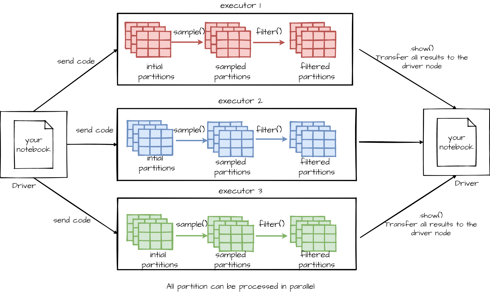
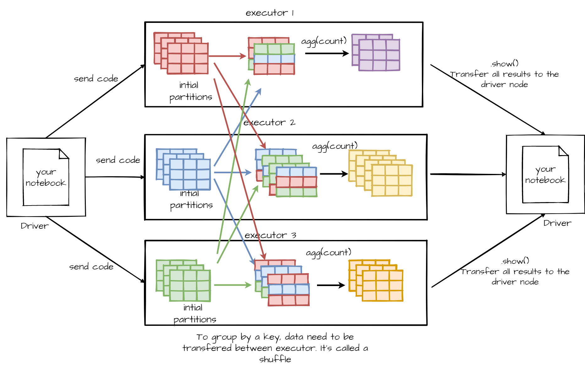

---

---

# Lab 2 - First steps with Spark

## Outline

1. Launching a Spark cluster on AWS
3. First steps with Spark

[TOC]


## ⛅Spark cluster creation in AWS

First: **DO NOT FORGET TO TURN YOUR CLUSTER OFF A THE END OF THIS TUTORIAL!**

- [ ] Once connected to the management console, search for "EMR" (Elastic Map Reduce). It a platform as a service made to manage Hadoop cluster in AWS. You just have to choose the configuration of your cluster (how many machines ? How many CPU/Ram ? Which release for Spark ?) and AWS will create your cluster. Doing this all by yourself is time consuming and not a pleasant task. That's why cloud providers provide service like EMR.

- [ ] You should land on a page like this
  
  Next time it should be this one
  
  In every cases click on `Créer un cluster`
  
- [ ] One the next page, select this configuration :

  - [ ] Nom du cluster : A descriptive name, like Cluster_First_Step_With_Spark

  - [ ] Journalisation : uncheck it. It's only to save in S3 the log of your cluster. It's useful to debug your application when you run un script and not a notebook.

  - [ ] Mode de lancement : `Cluster`. The difference between `Cluster` et `Exécution d'étape` is that `Cluster` create a cluster made for interactive processing, and`Exécution d'étape` create a cluster, run one or several script and stop it at the end. It's useful to run long processes not for data exploration.

  - [ ] Libérée (Release en VO) : `emr-5.31.0`, other version have some issues

  - [ ] Type d'instance : https://pickerwheel.com/pw?id=sNKV2 spin to know your instance type.

  - [ ] Nombre d'instance :  `3`, but every number between 2 and 6 should be fine.

    Here is a table with the hourly price of some instances just to give you an idea of the cost of an EMR cluster

    | Instance   | Hourly price |
    | ---------- | ------------ |
    | m5.xlarge  | 0.24$        |
    | m5.2xlarge | 0.48$        |
    | m5.4xlarge | 0.96$        |
    | m5.8xlarge | 1.86$        |

  - [ ] Paire de clé EC2 : select  `Sans paire de clé EC2` ok `Aucune paire de clé trouvée`

  - [ ] Then click on `Créer un cluster`

    Your page should look like this :

    

    It's possible you get an error like this one :
    
    > Résilié avec des erreursThe requested instance type m5.xlarge is not supported in the requested  availability zone. Learn more at  https://docs.aws.amazon.com/console/elasticmapreduce/ERROR_noinstancetype
    
    The physical resources of AWS's datacenters are not unlimited, and AWS keeps some room for manoeuvre for top priority users. So sometimes we, low priority users, cannot use some resources. If this problem happens, just recreate a cluster with a less powerful machine, like m4.xlarge
    
    ⏳The cluster creation takes time (around 5 min), please wait 

- [ ] Once your cluster in "En attente" or "Stand by" (so after 5 min at least), go to `blocs-notes`, then click on `Créer un bloc-notes`
  

- [ ] Next you have to configure your notebook. It's pretty easy

  - [ ] Give a descriptive name to your notebook
  - [ ] Select your brand new cluster
  
  And for this lab it's enough.
  
Your screen should look like this :
  

  
- [ ] The notebook creation should be fas. Once your notebook is ready click on `Ouvrir dans JupyterLab`. This will open JupiterLab. Create a notebook with a pyspark kernel and run the following line

  ```
  spark
  ```

  If everything is ok you should get something like this
  

If not, just check if your cluster is `En attente`. If not, just wait, if so, ask for help.

**DO NOT FORGET TO TURN YOUR CLUSTER OFF A THE END OF THIS TUTORIAL!**


## 💾First steps with Spark - Data importation

Spark's main object class is the DataFrame, which is a distributed table. It is analogous to R's or Python (Pandas)'s data frames: one row represents an observation, one column represents a variable. But contrary to R or Python, Spark's DataFrames can be distributed over hundred of nodes.

Spark support multiple data formats, and multiple  ways to load them.

- data format : csv, json, parquet (an open source column oriented format)
- can read archive files
- schema detection or user defined schema. For static data, like a json file, schema detection can be use with good results.

Spark has multiple syntaxes to import data. Some are simple with no customisation, others are more complexes but you can specify options.

The simplest syntaxes to load a json or a csv file are :

```python
# JSON
json_df = spark.read.json([location of the file])
# csv
csv_df = spark.read.csv([location of the file])

```

In the future, you may consult the [Data Source documentation](https://spark.apache.org/docs/latest/sql-data-sources.html) to have the complete description of Spark's reading abilities.

---

### **✍Hands-on 1 ** 

- Load the json file store here : `s3n://spark-lab-input-data-ensai20202021/tweets/tweets20210414-143312.jsonl.gz` and name you data frame `df_tweet`

    <small> ⚙️ This file is an a `JSONL` (JSON-line) format, which means that each line of it is a JSON object. A JSON object is just a Python dictionary or a JavaScript object and looks like this: `{ key1: value1, key2: ["array", "of", "many values]}`). This file has been compressed into a `GZ` archive, hence the `.jsonl.gz` ending. Also this file is not magically appearing in your S3 storage. It is hosted on one of your teacher's bucket and has been made public, so that you can access it.</small>
  
- It's possible to load multiple file in a unique DataFrame. It's useful when you have daily files and want to process them all. It's the same syntax as the previous one, just specify a folder. Like `s3n://spark-lab-input-data-ensai20202021/tweets/`. Name you DataFrame `df_tweet_big`

Now you have two DataFrames 🎉.

Remember that **Spark is lazy**, in the sense that it will avoid at all cost to perform unnecessary operations and wait to the last moment for performing only the duly requested computations. (Maybe you remember that R is lazy in that sense, but Spark is one degree more lazy than R.)

- Knowing that, do you think that when you run `spark.read.json()`, the data is actually migrated from S3 to the cluster ? If you want some data to be actually loaded, you can use the `show(n)` method (omitting `n` defaults to 20).

Sparks has very loose constraints on what you can actually store in a DataFrame column. The objects we just imported are actually quite messy.

- Use the `printSchema()` method to see the structure of one object.

**Spark's DataFrames are immutable**: there is no method to alter one specific value once one is created. This on purpose: mutations are famously hard to track, and Spark want to track them in order to avoid unnecessary computations. Suppressing mutations is actually the the best way to track changes.

Also, **DataFrames are distributed over the cluster**: they are split into blocks, ill-named **partitions**[^partition], that are stored separately in the memory of the workers nodes. Since Spark is lazy evaluation, all reading and intermediary computation is only kept in memory as your data are being processed.

[^partition]: In mathematics and data science, the "partition" of set $E$ is usually any collection of subsets whose union makes $E$ and whose 2-by-2 intersections are empty. But in Spark a "partition" refers to **one** block, not the set of blocks. And even if we consider the set, when replication is enforced, intersections between blocks are not necessarily empty. However, the union of all the blocks do produce the full original set.
## 🥉Data frame basic manipulations

If DataFrames are immutable, they can however be **_transformed_** in other DataFrames, in the sense that a modified copy is returned. Such **transformations** include: filtering, sampling, dropping columns, selecting columns, adding new columns...

First, you can get information about the columns with:

```python
df.columns       # get the column names
df.schema        # get the column names and their respective type
df.printSchema() # same, but human-readable
```

You can select columns with the `select()` method. It takes as argument a list of column name. For example :

```python
df_with_less_columns = df\
  .select("variable3","variable_four","variable-6")

# Yes, you do need the ugly \ at the end of the line,
# if you want to chain methods between lines in Python
```

You can get nested columns easily with :

```python
df.select("parentField.nestedField")
```

To filter data you could use the `filter()` method. It take as input an expression that gets evaluated for each observation and should return a boolean. Sampling is performed with the `sample()` method. For example :

```python
df_with_less_rows = df\
  .sample(fraction=0.001)\
  .filter(df.variable1=="value")\
  .show(10)
```

As said before your data are distributed over multiple nodes (executors) and data inside a node are split into partitions. Then each transformations will be run in parallel. They are called *narrow transformation* For example, to sample a DataFrame, Spark sample every partitions in parallel because sample all partition produce the sample DataFrame. For some transformations, like `groupBy()` it's impossible, and it's cannot be run in parallel.



<!-- take() collect() limit() first() show() -->
<!-- lien vers la doc https://spark.apache.org/docs/3.1.1/api/python/reference/pyspark.sql.html#dataframe-apis -->

### 😴Lazy evaluation

This is because Spark has what is known as **lazy evaluation**, in the sense that it will wait as much as it can before performing the actual computation. Said otherwise, when you run an instruction such as:

```python
tweet_author_hashtags = df_tweet_big.select("auteur","hashtags")
```

... you are not executing anything! Rather, you are building an **execution plan**, to be realised later.

Spark is quite extreme in its laziness, since only a handful of methods called **actions**, by opposition to **transformations**, will trigger an execution. The most notable are:

1. `collect()`, explicitly asking Spark to fetch the resulting rows instead of to lazily wait for more instructions,
2. `take(n)`, asking for `n` first rows
3. `first()`, an alias for `take(1)`
4. `show()` and `show(n)`, human-friendly alternatives[^5]
5. `count()`, asking for the numbers of rows
6. all the "write" methods (write on file, write to database), see [here](https://spark.apache.org/docs/3.1.1/api/python/reference/pyspark.sql.html#input-and-output) for the list

[^5]: `first()` is exactly `take(1)` ([ref]( https://stackoverflow.com/questions/37495039/difference-between-spark-rdds-take1-and-first)) and show prints the result instead of returning it as a list of rows ([ref](https://stackoverflow.com/questions/53884994/what-is-the-difference-between-dataframe-show-and-dataframe-take-in-spark-t))

**This has advantages:** on huge data, you don't want to accidently perform a computation that is not needed. Also, Spark can optimize each **stage** of the execution in regard to what comes next. For instance, filters will be executed as early as possible, since it diminishes the number of rows on which to perform later operations. On the contrary, joins are very computation-intense and will be executed as late as possible. The resulting **execution plan** consists in a **directed acyclic graph** (DAG) that contains the tree of all required actions for a specific computation, ordered in the most effective fashion.

---

### **✍Hands-on 2 ** 

- Define a DataFrame `tweet_author_hashtags`  with only the `auteur` and `hashtags` columns
- Print (few lines of) a DataFrame with only the `auteur`, `mentions`, and `urls` columns. (`mentions` and `urls` are both nested columns in `entities`.)
- Filter your first DataFrame and keep only tweets with more than 1 like. Give a name for this new, transformed DataFrame and print. Print (few lines of) it.
---

**This has also drawbacks.** Since the computation is optimized for the end result, the intermediate stages are discarded by default. So if you need a DataFrame multiple times, you have to cache it in memory because if you don't Spark will recompute it every single time. 

## 🥈Basic DataFrame column manipulation 

<!-- Je réfléchis`a la volée. Est-ce qu'on grouperait pas comme ça:
(1) show, take, firs, collect et discussion sur la distribution des données ;
(2) drop, select, filter, et discussion sur la laziness ;
(3) sample, withColumn, etc. et discussion sur l'immutabilité 
? -->

You can add/update/rename column of a DataFrame with spark :

- Drop : `df.drop(columnName : str )`
- Rename : `df.withColumnRenamed(oldName : str, newName : str)`
- Add/update : `df.withColumn(columnName : str, columnExpression)` 

For example

```python
tweet_df_with_like_rt_ratio = tweet_df\
  .withColumn(        # computes new variable
    "like_rt_ratio", # like_rt_ratio "OVERCONFIDENCE"
    (tweet_df.like_count /flights.retweet_count
   )

```

See [here](https://spark.apache.org/docs/3.1.1/api/python/reference/pyspark.sql.html#functions) for the list of all functions available in an expression.

### **✍Hands-on 3** 

- Define a DataFrame with a column names `interaction_count`. This column is the sum of `like_count`, `reply_count` and `retweet_count`.
- Update the DataFrame you imported at the beginning of this lab and drop the `other` column


## 🥇Advance DataFrame column manipulation 

### 🥽Array manipulation

Some columns often contain arrays (lists) of values instead of just one value. This may seem surprising but this actually quite natural. For instance, you may create an array of words from a text, or generate a list of random numbers for each observation, etc.

You may **create array of values** with:
- `split(text : string, delimiter : string)`, turning a text into an array of strings

You may **use array of values** with:
- `size(array : Array)`, getting the number of elements

- `array_contains(inputArray : Array, value : any)`, checking if some value appears

- `explode(array : Array)`, unnesting an array and duplicating other values. For instance it if use `explode()` over the hashtags value of this DataFrame:

  | Auteur | Contenu                             | Hashtags         |
  | ------ | ----------------------------------- | ---------------- |
  | Bob    | I love #Spark and #bigdata          | [Spark, bigdata] |
  | Alice  | Just finished #MHrise, best MH ever | [MHrise]         |

  I will get :

  | Auteur | Contenu                             | Hashtags         | Hashtag |
  | ------ | ----------------------------------- | ---------------- | ------- |
  | Bob    | I love #Spark and #bigdata          | [Spark, bigdata] | Spark   |
  | Bob    | I love #Spark and #bigdata          | [Spark, bigdata] | bigdata |
  | Alice  | Just finished #MHrise, best MH ever | [MHrise]         | MHrise  |

  

All this function must be imported first :

```python
from pyspark.sql.functions import split, explode, size, array_contains
```

Do not forget, to create a new column, you should use `withColumn()`. For example : 

```python
df.withColumn("new column", explode("array"))
```

#### **✍Hands-on 4** 

- Keep all the tweets with hashtags and for each remaining line, split the hashtag text into an array of hashtags
- Create a new column with the number of words of the `contenu` column. (Use `split()` + `size()`)
- Count how many tweet contain the `#COVID19` hashtag.(use the `count()` action)

### 🥼User defined function

For more very specific column manipulation you will need Spark's `udf()` function (*User Defined Function*). It can be useful if you Spark does not provide a feature you want. But Spark is a popular and active project, so before coding an udf, go check the documentation. For instance for natural language processing, Spark already has some [functions](https://spark.apache.org/docs/3.1.1/api/python/reference/api/pyspark.ml.feature.Tokenizer.html#pyspark.ml.feature.Tokenizer). Last things, python udf can lead to performance issues (see https://stackoverflow.com/a/38297050) and learning a little bit of scala or java can be a good idea.

For example :

```python
# !!!! DOES NOT WORK !!!!
def to_lower_case(string):
	return string.lower()
	
df.withColumn("tweet_lower_case", to_lower_case(df.contenu))
```

will just crash. Keep in mind that Spark is a distributed system, and that Python is only installed on the central node, as a convenience to let you execute instructions on the executor nodes. But by default, pure Python functions can only be executed where Python is installed! We need `udf()` to enable Spark to send Python instructions to the worker nodes.

Let us see how it is done :

```python
# imports
from pyspark.sql.functions import udf
from pyspark.sql.functions import explode
from pyspark.sql.types import StringType

# pure python functions
def to_lower_case(string):
    return string.lower()

# user definid function
to_lower_case_udf = udf(
    lambda x: to_lower_case(x), StringType()
) #we use a lambda function to create the udf.

# df manipulation
df_tweet_small\
  .select("auteur","hashtags")\
  .filter("size(hashtags)!=0")\
  .withColumn("hashtag", explode("hashtags"))\
  .withColumn("hashtag", to_lower_case_udf("hashtag")).show(10)
```

---

#### **✍Hands-on 5** 

- Create an user defined function that counts how many words a tweet contains. (your function will return an `IntegerType` and not a `StringType`)

## 🔩Aggregation functions

Spark offer a variety of aggregation functions :

- `count(column : string)` will count every not null value of the specify column. You cant use `count(1)` of `count("*")` to count every line (even row with only null values)

- `countDisctinct(column : string)` and `approx_count_distinct(column : string, percent_error: float)`. If the exact number is irrelevant, `approx_count_distinct()`should be preferred.

  Counting distinct elements cannot be done in parallel, and need a lot data transfer. But if you only need an approximation, there is a algorithm, named hyper-log-log (more info [here](https://databricks.com/fr/blog/2016/05/19/approximate-algorithms-in-apache-spark-hyperloglog-and-quantiles.html)) that can be parallelized. 

  ```python
  from pyspark.sql.functions import count, countDistinct, approx_count_distinct
  
  df.select(count("col1")).show()
  df.select(countDistinct("col1")).show()
  df.select(approx_count_distinct("col1"), 0.1).show()
  ```

- You have access to all other common functions `min()`, `max()`, `first()`, `last()`, `sum()`, `sumDistinct()`, `avg()` etc (you should import them first `from pyspark.sql.functions import min, max, avg, first, last, sum, sumDistinct`) 

---

### **✍Hands-on 6**

- What are the min, max, average of `interaction_count`
- How many tweets have hashtags ? Distinct hashtags ? Try the approximative count with 0.1 and 0.01as maximum estimation error allowed.

## 🧲Grouping functions

Like SQL you can group row by a criteria with Spark. Just use the `groupBy(column : string)` method. Then you can compute some aggregation over those groups.

```python
df.groupBy("col1").agg(
  count("col2").alias("quantity") # alias is use to specify the name of the new column
).show() 
```

The `agg()` method can take multiples argument to compute multiple aggregation at once.

```python
df.groupBy("col1").agg(
	count("col2").alias("quantity"), min("col2").alias("min"), avg("col3").alias("avg3") ).show()
```

Aggregation and grouping transformations work differently than the previous method like `filter()`, `select()`, `withColumn()` etc. Those transformations cannot be run over each partitions in parallel, and need to transfer data between partitions and executors.  They are called "wide transformations"



---

### **✍Hands-on 7**

- Compute a daframe with the min, max and average retweet of each `auteur`. Then order it by the max number of retweet in descending order by . To do that you can use the following syntax

  ```python
  from pyspark.sql.functions import desc
  def.orderBy(desc("col"))
  ```

## 🔌Spark SQL

Spark understand SQL statement. It's not a hack nor a workaround to use SQL in Spark, it's one a the more powerful feature in Spark. To use SQL in you need :

1. Register a view pointing to your DataFrame

    ```python
    my_df.createOrReplaceTempView(viewName : str)
    ```
    
2. Use the sql function

    ```python
    spark.sql("""
    You sql statment
    """)
    ```

    You could manipulate every registered DataFrame by their view name with plain SQL.

In fact you can do most of this tutorial without any knowledge in PySpark nor Spark. Lot of things can be done in Sparkk only by only knowing SQL and how to use it in Spark. 

### **✍Hands-on 8**

- How many tweets have hashtags ? Distinct hashtags ? 

- Compute a dataframe with the min, max and average retweet of each `auteur` using Spark SQL


- Compute a DataFrame with the min, max and average retweet of each author. Then sort it (using the `sort(column : string)` method) and print it.
<!-- one exercice more ? -->

<!-- I can help with that tomorrow, but can we add a (short) exercise on the principle of parallelised computation, like last year with the sum and / or the meand ? It can be a purely theoretical exercice. -->

## 🎫Joins in Spark

Like a SQL, Spark can join two dataset  by comparing the value of one or more keys using joins. Joins are by nature wide transformation, so data will be transferred between executors and will take time. But Spark will distinct two cases :

- Big table to big table join
- Big table to small table join
- (The case small table to small table is irrelevant for big data)

And optimize the join according to the actual case. (For more information Spark: The Definitive Guide pages 148 - 151)

Doing a join is pretty easy. You need :

- At least two DataFrames (obviously) with columns with the same keys
- a join expression
- the join transformation

For instance :

```python
# Creation of 3 small DF
person=spark.createDataFrame([
    (0,"Bill Chambers",0,[100])
    ,(1,"Matei Zaharia",1,[500,250,100])
    ,(2,"Michael Armbrust",1,[250,100])])\
	.toDF("id","name","graduate_program","spark_status")
graduateProgram=spark.createDataFrame([
    (0,"Masters","School of Information","UC Berkeley")
    ,(2,"Masters","EECS","UC Berkeley"),(1,"Ph.D.","EECS","UC Berkeley")])\
	.toDF("id","degree","department","school")
sparkStatus=spark.createDataFrame([
    (500,"Vice President")
    ,(250,"PMC Member")
    ,(100,"Contributor")])\
	.toDF("id","status")
    
# A join expression
joinExpression=person["graduate_program"]==graduateProgram['id']

# The join transformation in action
person.join(graduateProgram, joinExpression).show()
```

By default Spark compute inner joins, but you can pass a third argument to the join transformation with its type. You can do :

- Inner joins : by default or with the "inner" argument
- Outer joins : "outer" argument
- Left / right outer joins : "left_outer", "right_outer" argument
- Left semi join : it's more a filter than a join. It only keep the row in the left DataFrame that have a match in the right DataFrame. Use he "left_semi" argument
- Left anti join : The opposite of the previous one. Use he "left_anti" argument
- You can do cross joins to, but it's a very bad idea to do so, so please don't !

### **✍ Hands-on 9**

- Import the files stored in `s3n://spark-lab-input-data-ensai20202021/users/` in a DataFrame  and its informations to your DataFrame. Filter your new DataFrame to only keep verified user (`verified == True`) and group by user and get the most active user of your DataFrame.


**DO NOT FORGET TO TURN YOUR CLUSTER OFF!**

**DO NOT FORGET TO TURN YOUR CLUSTER OFF!**

**DO NOT FORGET TO TURN YOUR CLUSTER OFF!**

**DO NOT FORGET TO TURN YOUR CLUSTER OFF!**

**DO NOT FORGET TO TURN YOUR CLUSTER OFF!**

**DO NOT FORGET TO TURN YOUR CLUSTER OFF!**

**DO NOT FORGET TO TURN YOUR CLUSTER OFF!**

**DO NOT FORGET TO TURN YOUR CLUSTER OFF!**