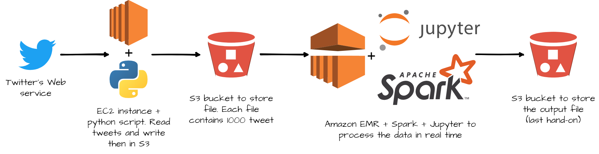

# Lab4- Stream processing with Spark

**DO NOT FORGET TO TURN YOUR CLUSTER OFF A THE END OF THIS TUTORIAL!**

## 1. 🔔Outline

This lab will teach you the basic of **stream processing with Spark**. As soon as an application compute something with business value  (for instance customer activity), and new inputs arrive continuously, companies will want to compute this result continuously too. Spark makes possible to process stream with the **Structured Streaming API**. This lab will teach you the basics of this Spark's API. Because the Structured Streaming API is based on the DataFrame API most syntaxes of lab 2 are still relevant.

## ⛅​ 2. Spark cluster creation in AWS

First: **DO NOT FORGET TO TURN YOUR CLUSTER OFF A THE END OF THIS TUTORIAL!**

Instructions are at the beginning of lab 2. Or you can just clone you cluster ;)

## :gear: 3. Configuration of the notebook


```python
# Configuraion
# The user pay the data transfer
spark._jsc.hadoopConfiguration().set("fs.s3.useRequesterPaysHeader","true")

# Set the number of shufflre partitions
spark.conf.set("spark.sql.shuffle.partitions", 5)

# Import all the needed library
from time import sleep
from pyspark.sql.functions import from_json, window, col, expr
from pyspark.sql.types import StructType,StructField, StringType, IntegerType, ArrayType, TimestampType, BooleanType, LongType, DoubleType

```

**Explanation:**

   - `spark._jsc.hadoopConfiguration().set("fs.s3.useRequesterPaysHeader","true")` : likes in lab2, you will be charged for the data transfer. without this configuration you can't access the data. 

- `spark.conf.set("spark.sql.shuffle.partitions", 5)` : set the number of partitions for the shuffle phase. A partition is in Spark the name of a bloc of data. By default Spark use 200 partitions to shuffle data. But in this lab, our mini-batch will be small, and to many partitions will lead to performance issues.

  ````
spark.conf.set("spark.sql.shuffle.partitions", 5)
  ````

  > :thinking: The shuffle dispatches data according to their key between a *map* and a *reduce* phase. For instance, if you are counting how many records have each `g` group, the *map* phase involve counting each group member in each Spark partition : `{g1:5, g2:10, g4:1, g5:3}` for one partition, `{g1:1, g2:2, g3:23, g5:12}` for another. The *shuffle* phase dispatch those first results  and group them by key in the same partition, one partition gets `{g1:5, g1:1, g2:10, g2:2}`, the other gets : `{g4:1, g5:3, g3:23, g5:12}` Then each *reduce* can be done efficiently. 

- :package: Import all needed library

  ````python
  from time import sleep
  from pyspark.sql.functions import from_json, window, col, expr
  from pyspark.sql.types import StructType,StructField, StringType, IntegerType, ArrayType, TimestampType, BooleanType, LongType, DoubleType
  ````

## 4.:shower: Stream processing 

Stream processing is the act to process data in real-time. When a new record is available, it is processed. There is no real beginning nor end to the process, and there is no "result". The result is updated in real time, hence multiple versions of the results exist. For instance, you want to count how many tweet about cat are posted in twitter every hour. Until the end of an hour, you do not have you final result. And even at this moment, your result can change. Maybe some technical problems created some latency and you will get some tweets later. And  you will need to update your previous count.

Some commons use cases of stream processing are :

- **Notifications and alerting :**  real-time bank fraud detection ; electric grid monitoring with smart meters ; medical monitoring with smart meters, etc.
- **Real time reporting:**  traffic in a website updated every minute; impact of a publicity campaign  ; stock option portfolio, etc.
- **Incremental ELT (extract transform load):**  new unstructured data are always available and they need to be processed (cleaned, filtered, put in a structured format)  before their integration in the company IT system.
- **Online machine learning :** new data are always available and used by a ML algorithm to improve its performance dynamically.

Unfortunately, stream processing has some issues. First because there is no end to the process, you cannot keep all the data in memory. Second, process a chain of event can be complex. How do you raise an alert when you receive the value 5, 6 and 3 consecutively ? Don't forget you are in a distributed environment, and there is latency. Hence, the received order can be different from the emitted order.

## 5. ✨ Spark and stream processing :shower:

Stream processing was gradually incorporated in Spark. In 2012 Spark Streaming and it's DStreams API  was added to Spark (it was before an external project). This made it possible use high-level operator like `map` and `reduce` to process stream of data. Because of its implementation, this API has some limitations, and its syntax was different from the DataFrame one. Thus, in 2016 a new API was added, the Structured Streaming API. This API is directly build built on DataFrame, unlike DStreams. **This has an advantage, you can process your stream like static data**. Of course there are some limitations, but the core syntaxes is the same. You will chain transformations, because each transformation takes a DataFrame as input and produces a DataFrame as output. The big change is there is no action at the end, but an **[output sink](#2.2 How to output a stream ?)**.


*Figure 1 : data stream representation (source [structured streaming programming guide](https://spark.apache.org/docs/latest/structured-streaming-programming-guide.html#basic-concepts))*

Spark offer two ways to process stream, one **record at a time**, or processing **micro batching** (processing a small amount of line at once). 

- **one record at a time**  every time a new record is available it's processed. This has a big advantage, it achieves **very low latency **. But there is a drawback, the system can not handle too much data at the same time (low throughput). It's the default mode. Because in this lab, you will process files with record, even if you will process one file at a time, you will process mini batch of records
- as for **micro batching** it process new records every `t` seconds. Hence records are not process really in "real-time", but periodically, **the latency will be higher, and so the throughput**. Unless you really need low latency, make it you first choice option.

> 🧐 To get the best ratio latency/throughput, a good practice is to decrease the micro-batch size until the mini-batch throughput is the same as the input throughput. Then increase the size to have some margin


*Figure 2 : which Spark solution suit best giving latency requirement (source : [Learning Spark, O'Reilly](https://pages.databricks.com/rs/094-YMS-629/images/LearningSpark2.0.pdf))*

> To understand why processing one record at a time has lower latency and throughput than batch processing, imagine a restaurant. Every time a client order something the chef cooks its order independently of the other current orders. So if two clients order pizza, the chief makes two small doughs, and cook them individually. If clients there is only a few clients, the chief can finish each order before a new client comes. The latency is the lowest possible when the chief is idle when a client come. Know imagine a restaurant were the chief process the orders by batch. He waits some minutes to gather all the orders than he mutualizes the cooking. If there are 5 pizza orders, he only does one big dough, divides it in five, add the toppings then cook all five at once. The latency is higher because the chief waits before cooking, but so the throughput because he can cook multiple things at once.

## 6. 🥉 The basics of Spark's Structured Streaming 

### 6.1. 📚 The different sources for stream processing in Spark 

In lab 2 you discovered Spark DataFrame, in this lab you will learn about [Structured Streaming](https://spark.apache.org/docs/latest/structured-streaming-programming-guide.html). It's a stream processing framework built on the Spark SQL engine, and it uses the existing structured APIs in Spark. So one you define a way to read a stream, you will get a DataFrame. Like in lab2 ! **So except state otherwise, all transformations presented in lab2 are still relevant in this lab**.

 Spark Streaming supports several input source for reading in a streaming fashion :

- [Apache Kafka](https://kafka.apache.org/) an open-source distributed event streaming platform (not show in this lab)
- Files on distributed file system like HDFS or S3 (Spark will continuously read new files in a directory)
- A network socket : an end-point in a communication across a network (sort of very simple webservice). It's not recommend for *production* application, because a socket connection doesn't provide any  mechanism to check the consistency of data.

Defining an input source is like loading a DataFrame but, you have to replace `spark.read` by `spark.readStream`. For instance, if I want to open a stream to a folder located in S3 you have to read every new files put in it, just write

```python
my_first_stream = spark\
.readStream\
.schema(schema_tweet)\
.json("s3//my-awesome-bucket/my-awesome-folder")
```

The major difference with lab2, it is Spark cannot infer the schema of the stream. You have to pass it to Spark. There is two ways :

- A reliable way : you define the schema by yourself and gave it to Spark
- A quick way : you load one file of the folder in a DataFrame, extract the schema and use it. It works, but the schema can be incomplete. It's a better solution to create the schema by hand and use it. 

For Apache Kafka, or socket , it's a slightly more complex, *(not used today, it's jute for you personal knowledge)* :

```python
my_first_stream = spark\
.readStream\
.format("kafka")
.option("kafka.bootstrat.servers", "host1:port1, host2:port2 etc")
.option("subscribePattern", "topic name")
.load()
```

#### 6.1.1 🤨Why is a folder a relevant source in stream processing ? 

Previously, in lab 2, you loaded all the files in a folder stored in S3 with Spark. And it worked pretty well. But this folder was static, in other words, Its content didn't change. But in some cases, new data are constantly written into a folder. For instance, in this lab you will process a stream of tweets. A python script is running in a EC2 machine reading tweets from the Twitter's web service and writing them in a S3 buckets. Every 2 seconds or so, a new file is added to the bucket with 1000 tweets. If you use DataFrame like in lab 2, your process cannot proceed those new files. You should relaunch your process every time. But with Structured Streaming Spark will dynamically load new files.



*Figure 3 : Complete lab architecture to stream process tweets*

> The remaining question is, why don't we connect Spark to the twitter webservice directly ? And the answer is : we can't. Spark cannot be connected to a webservice directly. You need a middle-man between Spark and a webservice. There are multiple solutions, but an easy and reliable one is to write tweet to s3 (because we use AWS services, if you use Microsoft Azure, Google Cloud  Platform or OVH cloud replace S3 by their storage service).

### ✍Hand-on 1 : open a stream

Like in lab 2, you will use tweets in this lab. The tweets are stored in jsonl file (*json line* every line of the file is a complete json). Here is an example. The schema changed a little, because this time tweets aren't pre-processed.

````js
{
    "data": {
        "public_metrics": {
            "retweet_count": 0,
            "reply_count": 0,
            "like_count": 0,
            "quote_count": 0
        },
        "text": "Day 93. Tweeting every day until Colby cheez its come back #bringcolbyback @cheezit",
        "possibly_sensitive": false,
        "created_at": "2021-05-03T07:55:46.000Z",
        "id": "1389126523853148162",
        "entities": {
            "annotations": [
                {
                    "start": 33,
                    "end": 43,
                    "probability": 0.5895,
                    "type": "Person",
                    "normalized_text": "Colby cheez"
                }
            ],
            "mentions": [
                {
                    "start": 75,
                    "end": 83,
                    "username": "cheezit"
                }
            ],
            "hashtags": [
                {
                    "start": 59,
                    "end": 74,
                    "tag": "bringcolbyback"
                }
            ]
        },
        "lang": "en",
        "source": "Twitter for iPhone",
        "author_id": "606856313"
    },
    "includes": {
        "users": [
            {
                "created_at": "2012-06-13T03:36:00.000Z",
                "username": "DivinedHavoc",
                "verified": false,
                "name": "Justin",
                "id": "606856313"
            }
        ]
    }
}
````

- Define a variable with this schema (you will find a file *schema pyspark tweet* on moodle with the schema to copy /aste)

  ```python
  from pyspark.sql.types import StructType,StructField, StringType, IntegerType, ArrayType, TimestampType, BooleanType, LongType, DoubleType
  
  StructType([
  	StructField("data", StructType([
  		StructField("author_id",StringType(),True),
  		StructField("text",StringType(),True),
  		StructField("source",StringType(),True),
  		StructField("lang",StringType(),True),
  		StructField("created_at",TimestampType(),True),
  		StructField("entities",StructType([
  			StructField("annotations", ArrayType(StructType([
  				StructField("end", LongType(), True),
  				StructField("normalized_text", StringType(), True),
  				StructField("probability", DoubleType(), True),
  				StructField("start", LongType(), True),
  				StructField("type", StringType(), True)
  			]),True),True),
  			StructField("cashtags", ArrayType(StructType([
  				StructField("end", LongType(), True),
  				StructField("start", LongType(), True),
  				StructField("tag", StringType(), True)
  			]),True),True),
  			 StructField("hashtags", ArrayType(StructType([
  				StructField("end", LongType(), True),
  				StructField("start", LongType(), True),
  				StructField("tag", StringType(), True)
  			]),True),True),
  			StructField("mentions", ArrayType(StructType([
  				StructField("end", LongType(), True),
  				StructField("start", LongType(), True),
  				StructField("username", StringType(), True)
  			]),True),True),
  			StructField("urls", ArrayType(StructType([
  				StructField("description", StringType(), True),
  				StructField("display_url", StringType(), True),
  				StructField("end", LongType(), True),
  				StructField("expanded_url", StringType(), True),
  				StructField("images", ArrayType(StructType([
  						StructField("height", LongType(), True),
  						StructField("url", StringType(), True),
  						StructField("width", LongType(), True)
  					]),True),True),
  				StructField("start", LongType(), True),
  				StructField("status", LongType(), True),
  				StructField("title", StringType(), True),
  				StructField("unwound_url", StringType(), True),
  				StructField("url", StringType(), True),
  			]),True),True),
  		]),True),
  		StructField("public_metrics", StructType([
  			StructField("like_count", LongType(), True),
  			StructField("reply_count", LongType(), True),
  			StructField("retweet_count", LongType(), True),
  			StructField("quote_count", LongType(), True),
  		]),True)
  	  ]),True),
  	StructField("includes", StructType([
  		StructField("users", ArrayType(StructType([
  			StructField("created_at", TimestampType(), True),
  			StructField("id", StringType(), True),
  			StructField("name", StringType(), True),
  			StructField("username", StringType(), True),
  			StructField("verified", BooleanType(), True)
  		]),True),True)
  	]),True)
    ])
  ```
  
- Crate a stream to this s3 bucket : `s3://spark-lab-input-data-ensai20202021/stream_tweet/`. Name it  `tweet_stream`

  > :thinking: Nothing happen ? It's normal ! Do not forget, Spark use lazy evaluation. It doesn't use data if you don't define an action. For now Spark only know how to get the stream, that's all.

- In a cell just execute `tweet_stream`. It should print the type of `tweet_stream` and the associated schema. You can see you created a DataFrame like in lab2 !

- To print the size of your DataFrame with this piece of code :

  ```python
  stream_size_query= tweet_stream\
  .writeStream\
  .queryName("stream_size")\
  .format("memory")\
  .start()
  
  for _ in range(10): # we use an _ because the variable isn't used. You can use i if you prefere
      sleep(3)
      spark.sql("""
      	SELECT count(1) FROM stream_size
      """).show()
  stream_size_query.stop() #needed to close the query
  
  ```
### 6.2. 🛒 How to output a stream ? 

Remember, Spark has two types of methods to process DataFrame:

-  Transformations which take a DataFrame has input and produce an other Dataframe
-  And actions, which effectively run computation and produce something, like a file, or a output in you notebook/console.

Stream processing looks the same as DataFrame processing. Hence, **you still have transformations**, the exact same one that can be apply on classic DataFrame (with some restriction, for example you can not sample a stream with the `sample()` transformation). The action part is a little different. Because a stream runs continuously, you cannot just print the data or run a count at the end of the process. **In fact actions will nor work on stream**. To tackle this issue, Spark proposes different [outputs sinks](https://spark.apache.org/docs/latest/structured-streaming-programming-guide.html#output-sinks). An output sink is a possible output for your stream. The different output sink are (this part came from the official Spark [documentation)](https://spark.apache.org/docs/latest/structured-streaming-programming-guide.html#output-sinks) : 

- **File sink** - Stores the output to a file. The file can be stored locally (on the cluster), remotely (on S3). The file format can be json, csv etc

```python
writeStream
    .format("parquet")        // can be "json", "csv", etc.
    .option("path", "path/to/destination/dir")
    .start()
```

- **Kafka sink** - Stores the output to one or more topics in Kafka.

- **Foreach sink** - Runs arbitrary computation on the records in the output. It does not produce an DataFrame. Each processed lines lost

```python
writeStream
    .foreach(...)
    .start()
```

- **Console sink (for debugging)** - Prints the output  to the console standard output (*stdout*) every time there is a trigger. This should be used for debugging  purposes on low data volumes as the entire output is collected and  stored in the driver’s memory after every trigger. *Sadly console sink does not work with jupyter notebook*.

```python
writeStream
    .format("console")
    .start()
```

- **Memory sink (for debugging)** - The output is stored in memory as an in-memory table. This should be used for debugging purposes on low data volumes as the entire output is collected and stored in the driver’s memory. Hence, use it with caution. Because we are in a simple lab, you will use this solution. But keep in mind it's a very bad idea because data must fit in the the ram of the driver node. And in a big data context it's impossible. Because it's not a big data problem if one computer can tackle it.

```python
writeStream
    .format("memory")
    .queryName("tableName") # to resquest the table with spark.sql()
    .start()
```

We just talked where we can output a stream, but there is another question, how ?

To understand why it's a issue, let's talk about two things that spark can do with streams : filter data and group by + aggregation

- **Filter** : your process is really simple. Every time you get a new data you just compute a score and drop records with a score less than a threshold. Then you write into a file every kept record. In a nutshell, you just append new data to a file. Spark does not have to read an already written row, it just add new data.
- **Group by + aggregation** : in this case you want to group by your data by key than compute a simple count. Then you want to write the result in a file. But now there is an issue, Spark needs to update some existing rows in your file every time it writes somethings. But is your file is stored in HDFS of S3, it's impossible to update in a none append way a file. In a nutshell, it's impossible to output in a file your operation.

To deal with this issue, Spark proposes 3 mode. **And you cannot use every mode with every output sink, with every transformation**. The 3 modes are ([more info here](https://spark.apache.org/docs/latest/structured-streaming-programming-guide.html#starting-streaming-queries)) :

- **Append mode (default)** - This is the default mode, where only the new rows added to the Result Table since the last trigger will be outputted to the sink. This is supported for only those queries where  rows added to the Result Table is never going to change. Hence, this mode  guarantees that each row will be output only once (assuming  fault-tolerant sink). For example, queries with only `select`,  `where`, `map`, `flatMap`, `filter`, `join`, etc. will support Append mode.
- **Complete mode** - The whole Result Table will be outputted to the sink after every trigger. This is supported for aggregation queries.
- **Update mode** - (*Available since Spark 2.1.1*) Only the rows in the Result Table that were  updated since the last trigger will be outputted to the sink.  More information to be added in future releases.

| Sink                  | Supported Output Modes   |
| --------------------- | ------------------------ |
| **File Sink**         | Append                   |
| **Kafka Sink**        | Append, Update, Complete |
| **Foreach Sink**      | Append, Update, Complete |
| **ForeachBatch Sink** | Append, Update, Complete |
| **Console Sink**      | Append, Update, Complete |
| **Memory Sink**       | Append, Complete         |

### 6.3. 👨‍🏫 How to output a stream : summary 

To sum up to output a stream you need

- DataFrame (because once load a stream is a DataFrame)
- A format for your output, like console to print in console, memory to keep the Result Table in memory, json to write it to a file etc
- A mode to specify how the Result Table will be updated.

For instance for the memory sink

```python
memory_sink = df\
.writeStream\
.queryName("my_awesome_name")\
.format('memory')\
.outputMode("complete" or "append")\
.start() #needed to start the stream
```


*Figure 4 : The different phases of stream processing in Spark*


### ✍Hand-on 2 : output a stream

#### 🗺 Lang count

- Compute a DataFrame that group and count data by the `lang` column. Name your DataFrame `lang_count`

- Use this DataFrame to create a output stream with the following configuration :

  - Names the variable `lang_query`
  - Memory sink
  - Complete mode (because we are doing an agregation)
  - Name you query `lang_count`

- Then past this code

  ````python
  for _ in range(10): # we use an _ because the variable isn't use. You can use i if you prefere
      sleep(3)
      spark.sql("""
      SELECT * FROM lang_count""").show()
  lang_query.stop() #needed to close the stream
  ````

  After 30 seconds, 10 tables will appeared in your notebook. Each table represents the contain of `lang_count` at a certain time. The `.stop()` method close the stream. 

  In the rest of this tutorial, to will need two steps to print data :

  1. Define a stream query with a memory sink
  2. Request this stream with the `spark.sql()` function

  Instead of a for loop, you can just write you `spark.sql()` statement in a cell and rerun it. In this case you will need a third cell with a `stop()` method to close your stream.

  For instance:

 - Cell 1
      ````python
      my_query = my_df\
          .writeStream\
          .format("memory")\
          .queryName("query_table")\
          .start()
      ````
      
 - Cell 2
      ```python
      spark.sql("SELECT * FROM query_table").show()
      ```
      
 - Cell 3
      ```python
      my_query.stop()
      ```

  #### :x: Count tweets with and without hashtag

- Add a column `has_hashtag` to your DataFrame. This column equals True if `data.entities.hashtags` is not null. Else it's false. Use the `withColumn` transformation to add a column. You can count the size of `data.entities.hashtags` to check if it's empty or not.
- Group and count by the `has_hashtag` column

- Print some results
## 7. 🥈Stream processing basics 

### ✍Hand-on 3 : transformations on stream 🧙‍♂️

- :hocho: Filter all records with missing / null value then group the remaining by `hashtag`.
     - For this filter, you will use the `na.drop("any")` transformation. The `na.drop("any")` drop every line with a null value in at least one column. It's simpler than using a `filter()` transformation because you don't have to specify all the column. For more precise filter you can use `na.drop("any" or "all", subset=list of col)` (`all` will drop rows with only null value in all columns or in the specified list).
     
- 🕵️‍♂️ Filter all records with no hashtag value then group the remaining by `hashtag`.

- :small_red_triangle_down: Column creation and filtering : 

  - Define a new column, name `covid_related`. This column is equal to `True` if `data.text` contains "covid", else it's  equal to`False`.
  
  -  Use the `withColumn()` transformation, and the `expr()` function to define the column. `expr()` takes as input an SQL expression. You do not need a full SQL statement (`SELECT ... FROM ... WHERE ...`) but just an SQL expression that return True or False if `data.text` contains "covid". To help you :
  
    - `LOWER()` put in lower case a string
    - `input_string LIKE wanted_string` return `True`  if `input_string` is equal to `wanted_string`
    - You can use `%` as wildcards
  
    [For more help](https://www.w3schools.com/sql/sql_like.asp)
  
  - Only keep `data.text`, `data.lang`, `data.public_metrics` and `data.created_at`

### ✍Hand-on 4 : Aggregation and grouping on stream 🧲

- Count the number of different hashtag.

- Group by hashtag  and compute the average, min and max of `like_count`

     - Use the `groupBy()` and `agg()` transformations

- Compute the average of `like_count`, `retweet_count` and `quote_count` :

     - across all `hashtag` and `lang`
     - for each `lang` across all `hashtag`
     - for each `hashtag` across all `lang`
     - for each `hashtag` and each `lang`

     To do so, replace the `groupBy()` transformation by the `cube()` one. `cube()` group compute all possible cross between dimensions passed as parameter. You will get something like this

     | hashtag | lang | avg(like_count) | avg(retweet_count) | avg(quote_count) |
     | ------- | ---- | --------------- | ------------------ | ---------------- |
     | cat     | null | 1               | 2                  | 3                |
     | dog     | null | 4               | 5                  | 6                |
     | ...     | ...  | ...             | ...                | ...              |
     | bird    | fr   | 7               | 8                  | 9                |
     | null    | en   | 10              | 11                 | 12               |
     | null    | null | 13              | 14                 | 15               |

     A `null` value mean this dimension wasn't use for this row. For instance, the first row gives the averages when `hashtag==cat` independently of the `lang`. The before last row gives averages when `lang==en` independently of the `hashtag`. And the last row gives the averages for the full DataFrame.

## 8. 🥇 ⌛Event-time processing 

Event-time processing consists in processing information with **respect to the time that it was created, not received**. It's a hot topic because sometime you will receive data in an order different from the creation order. For example, you are monitoring servers distributed across the globe. Your main datacentre is located in Paris. Something append in New York, and a few milliseconds after something append in Toulouse. Due to location, the event in Toulouse is likely to show up in your datacentre before the New York one. If you analyse data bases on the received time the order will be different than the event time. Computers and network are unreliable. Hence, when temporality is important, you must consider the creation time of the event and not it's received time.

Hopefully, Spark will handle all this complexity for you ! If you have a timestamp column with the event creation spark can update data accordingly to the event time. 

For instance is you process some data with a time window, Spark will update the result based on the event-time not the received time. So previous windows can be updated in the future.


*Figure 5 : Time-event processing, event grouped by time windows*


To work with time windows, Spark offers two type of windows

- Normal windows. You only consider event in a given windows. All windows are disjoint, and a event is only in one window.
- Sliding windows. You have a fix window size (for example 1 hour) and a trigger time (for example 10 minute). Every 10 minute, you will process the data with an event time less than 1h.


*Figure 6 : Time-event processing, event grouped by sliding time windows*

To create time windows, you need :

- to define a time window : `window(column_with_time_event : str or col, your_time_window : str, timer_for_sliding_window) : str`

- grouping row by event-time using your window :  `df.groupeBy(window(...))`

To produce the above processes :

```python
# Need some import
from pyspark.sql.functions import window, col

# word count + classic time window
df_with_event_time.groupBy(
	window(df_with_event_time.event_time, "5 minutes"),
	df_with_event_time.word).count()

# word count + sliding time window
df_with_event_time.groupBy(
	window(df_with_event_time.event_time, "10 minutes", "5 minutes"),
	df_with_event_time.word).count()
```

### ✍Hand-on 5 : Event-time processing :hourglass:

- Count the number of event with a 10 seconds time window (use the `created_at` column)
- Count the number of event by hashtag with a 30 seconds time window 
- Count the number of event with a 10 seconds time window sliding every 5 seconds 

### 8.1.🏆 ⏳ ​Handling late data with watermarks 

Processing accordingly to time-event is great, but currently there is one flaw. We never specified how late we expect to see data. This means, Spark will keep some data in memory forever. Because streams never end, Spark will keep in memory every time windows, to be able to update some previous results. But in some cases, you know that after some time, you don't expect new data, or very late data aren't relevant any more. In other words, after a certain amount of time you want to freeze old results.

Once again, Spark can handle such process, with watermarks.


*Figure 7 : Time-event processing with watermark*

To do so, you have to define column as watermark and a the max delay. You have to use the `withWatermark(column, max_delay)` method.

```python
# Need some import
from pyspark.sql.functions import window, col

# word count + classic time window
df_with_event_time.withWatermark(df_with_event_time.event_time, "4 minutes")\
.groupBy(
	window(df_with_event_time.event_time, "5 minutes"),
	df_with_event_time.word).count()

# word count + sliding time window
df_with_event_time.withWatermark(df_with_event_time.event_time, "4 minutes")\
.groupBy(
	window(df_with_event_time.event_time, "10 minutes", "5 minutes"),
	df_with_event_time.word).count()
```

#### ✍Hand-on 6 : Handling late data with watermarks :hourglass_flowing_sand:

- Count the number of event with a 10 seconds time window (use the `created_at` column) with a 5 seconds watermark
- Count the number of event by hashtag with a 30 seconds time window with a 1 minute watermark
- Count the number of event post by verified user with a 10 seconds time window sliding every 5 seconds with 25 seconds watermark. Write the the result in a file sorted in S3.

## For more details

- [Spark official documentation](https://spark.apache.org/docs/latest/structured-streaming-programming-guide.html#input-sources)
- ZAHARIA, B. C. M. (2018). *Spark: the Definitive Guide*. , O'Reilly Media, Inc. https://proquest.safaribooksonline.com/9781491912201
- https://databricks.com/blog/2018/03/13/introducing-stream-stream-joins-in-apache-spark-2-3.html
- https://databricks.com/blog/2016/07/28/structured-streaming-in-apache-spark.html
- https://databricks.com/blog/2015/07/30/diving-into-apache-spark-streamings-execution-model.html

**DO NOT FORGET TO TURN YOUR CLUSTER OFF A THE END OF THIS TUTORIAL!**

**DO NOT FORGET TO TURN YOUR CLUSTER OFF A THE END OF THIS TUTORIAL!**

**DO NOT FORGET TO TURN YOUR CLUSTER OFF A THE END OF THIS TUTORIAL!**

**DO NOT FORGET TO TURN YOUR CLUSTER OFF A THE END OF THIS TUTORIAL!**