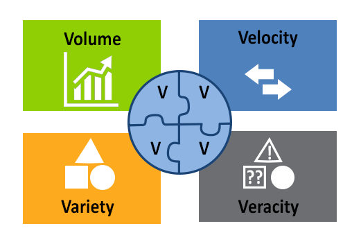
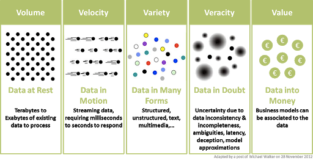
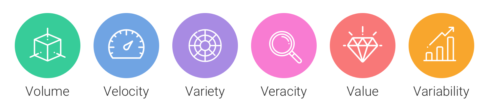
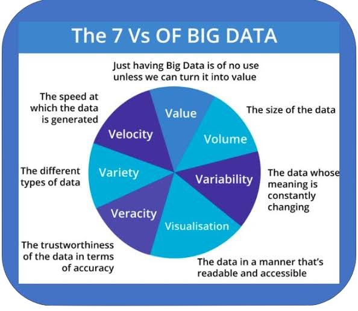
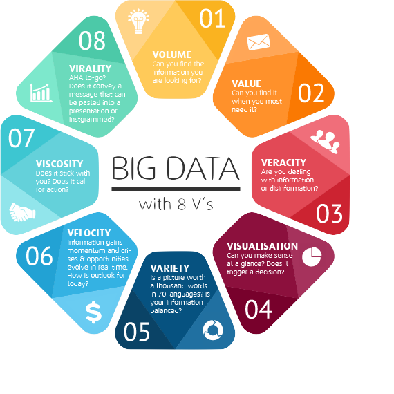
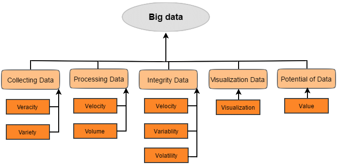
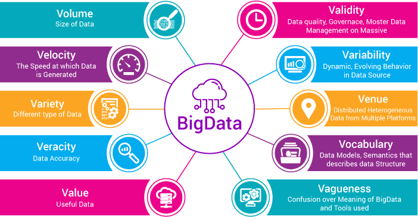
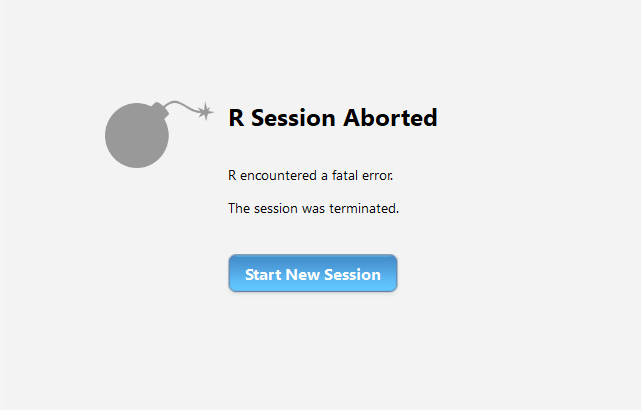

```{r setup, include=FALSE}
knitr::opts_chunk$set(echo = FALSE)
library(tidyverse)
```

<!-- intro sur la quantité de données produites -->


---

<blockquote class="twitter-tweet"><p lang="en" dir="ltr">Me taking algorithms class in college: &quot;Ugh, no one cares about computational complexity of all these sorting algorithms&quot; <br><br>Me trying to sort on a column in a 20TB <a href="https://twitter.com/hashtag/spark?src=hash&amp;ref_src=twsrc%5Etfw">#spark</a> table: &quot;Why is this taking so long?&quot; <a href="https://twitter.com/hashtag/DataScience?src=hash&amp;ref_src=twsrc%5Etfw">#DataScience</a> struggles.</p>&mdash; Nick Strayer (@NicholasStrayer) <a href="https://twitter.com/NicholasStrayer/status/1105127759318319105?ref_src=twsrc%5Etfw">March 11, 2019</a></blockquote> <script async src="https://platform.twitter.com/widgets.js" charset="utf-8"></script>

---

## What is "Big Data" ?


---

## What is "Big Data" ?

- started to be used in the 1990's

--

- is a vague, ill-defined notion

--

- refers to data that **cannot be managed by commonly-used software**

--

- is inherently relative to _**who**_ is using it and _**where**_

???

The term started to be used in the 1990's and is a ill-defined notion.

**Big Data** broadly refers to data that **cannot be managed by commonly-used software**.

<small>It is inherently relative to **who** and is using it. What is a common software for someone may not be for someone else. For instance, relational databases for someone used to use spreadsheet software.</small>

---

## What is "Big Data" ?

What can be considered "big" **evolves over time**  
since **software constantly improves capacity**.

.pull-left[

_Line and row limits of **Microsoft Excel** tablesheets_

```
           Version      Lines  Columns
until 1995     7.0     16 384      256
until 2003    11.0     65 536      256
from  2007    12.0  1 048 576   16 384
```
]

.pull-right[

_Max. number of items stored in one tablesheet_

```{r, echo=FALSE, fig.height=2, fig.width=3.5, out.width="100%", dpi=150}
breaks <- 10^(1:10)
tibble(
  measurement = "Excel (number of cells)",
  year        = c(1999,2003,2007),
  lines       = c(16384,65536,1048576),
  columns     = c(256,256,16384)
) %>%
  ggplot() +
  geom_line(aes(x=year,y=lines*columns, group="measurement")) +
  scale_y_log10(name=NULL, breaks=breaks) + # ,labels =scales::label_number()
  scale_x_continuous(name=NULL, breaks=1999:2010, minor_breaks = NULL) +
  expand_limits(y=1000000) +
  theme_minimal()
  # theme(axis.text.x = element_text(angle = -45, hjust = 0))
```

]

???

Target constantly moving as the performance of machines and software continues to increase.

For instance Excel, Microsoft's widely used tablesheet programme, can only cope with a limited number of lines and columns.

Today's "big data" is not yesterday's.

---

## What is "Big Data" ?

Besides software, **hardware is also evolving** :

- faster and more massive storage
- faster and more massive memory
- more and faster processors
- more specialized processors
- better connectivity
- improved architecture

For instance, it now possible to use graphic cards to perform computation.

???

Computers are every day more performent:
- faster and more massive storage
- faster and more massive memory
- more and faster processors
- more specialized processors (GPUs for computation, TPUs)
- better connectivity (inside the computer, good long-distance connectivity makes it possible to send computation to a remote location)
- improved architecture (quite technical but you can improve how the components interact)

---

## What is "Big Data" ?

Size is **not** the only thing that matters.

--

In a tablesheet program, what kind of information can't you store properly?


--
- relationnal data

--
- images, long texts

--
- unstructured data (ex: web page)

--
- rapidly varying data (ex: tweeter feed)

???

Neither is it only a question of size. Since we talk about Excel, it is clear that many different kind of data cannot be stored (or can difficultly be stored) in Excel, for instance:

In a tablesheet program, what kind of information can't you store properly? (ask audience)

---

## What is "Big Data" ?

The **"3 V's of Big Data"**

- **V**olume (massive, taking place)
- **V**elocity (fast, updated constantly)
- **V**ariety (tabular, structured, unstructured, of unknown nature, mixed)

**Specific challenges** to each **V**

???

You will often find the reference to the "3 V's of Big Data"

- **V**olume (massive, taking place)
- **V**elocity (fast, updated constantly)
- **V**ariety (tabular, structured, unstructured, of unknown nature, mixed)

Each of these aspects generates specific challenges, and we are often confronted to two or three of them simultaneously! In this large-scale machine-learning course, we will tackle the *volume* and *velocity* aspect.

Marketers and management gurus like to add V's to the V's. You will have **Value**, **Veracity**... and more. You will here about the "5 V's".

---

## What is "Big Data" ?

Marketers constantly **invent new V's**



---

## What is "Big Data" ?

Marketers constantly **invent new V's**



---

## What is "Big Data" ?

Marketers constantly **invent new V's**



---

## What is "Big Data" ?

Marketers constantly **invent new V's**

.pull-right[]

---

## What is "Big Data" ?

Marketers constantly **invent new V's**

.pull-right[]

---

## What is "Big Data" ?

Marketers constantly **invent new V's**


---

## What is "Big Data" ?

Marketers constantly **invent new V's**



---

## How big is "Big Data" ?

To this day, can be considered "big" for a data analyst :

- more than 1 000 000 rows and/or more than 100 000 columns
- one individual file over 4 Go ¹
- memory needs over 8-10 Go ²
- storage needs over 0.1 to 1 To ²
- processing taking over one hour (see later)

.footnote[
¹ <small>Limit for many old computers, external drives or USB sticks (FAT32 file system)</small>  
² <small>Average desktop</small>
]

---

## How big is "Big Data" ? (volume)

What is usually **not** an issue:

- file size on modern OS ³
- database management systems' *constraints* ⁴

--

What **is** usually an issue:
- your physical storage
- computation time

.footnote[
³ <small>Over 16 To for Window's NTFS, Unix's ext4 and Apple's APFS</small>  
⁴ <small>You will probably run out of disk space before you can reach MySQL's limit of 65 536 To</small>
]

???

Source:

- https://dev.mysql.com/doc/mysql-reslimits-excerpt/8.0/en/table-size-limit.html

---

## How fast is "Big Data" ? (velocity)

To this day, **any data change is challenging** for a data analyst :

- most data analysis is done with **data "at rest"**
- version control (slow-changing data) or stream (fast-changing)

--
- current effort to port version control from code to data and to processing pipelines ¹

--
- most spreadsheet or statistical software is not well adapted to streams of data
- processing data streams can be challenging (delay, keep the order, retrain the model ?)

.footnote[
¹ <small>Processing pipelines notably include (but are not restricted to) data wrangling, ETL (extract, transform and load) and ML-Ops (machine-leaning operations ; e.g updating machine-learning model when in production).</small>
]

???
Retrain a model takes time
Your conclusions at time T can change at T+n

---

## How heterogeneous is "Big Data" ? (variety)

To this day, **any non-textual format** and **any non-standard textual format** is an issue for data scientist:

- **images**, **sounds**, **videos** are not supported by most spreadsheets or statistical software and rarely supported by non-specialized databases
- any non-standard format is a challenge (ex: annotated texts, vocal message conversations, etc.). How to store ? How to process ?

What is usually **not** an issue:

- storing network data (e.g. social graphs) (neo4J)
- storing formatted text such as XML, JSON, HTML, etc (mongoDB)
- storing raw, unformatted text (Elasticsearch, apache Solr)
- storing spatial data (PostGIS)

--

Processing those data can be hard and takes time

---

## From big-data to large-scale computing

**BUT data do not just sit here:**

- we copy, transform, use data : **data pipeline**

- "big" data are especially **data that take time to process**

- focus shift from "big data" to **"large-scale computing"**

There are **many possible issues** with processing a lot of data...


---

## From big-data to large-scale computing

...problems of **memory**...


???

If storage is usually not an issue nowadays, memory is! (Memory is shared between all the programs on your computer and is actually limited.) We need clever methods to prevent these problems to happen.

---

## From big-data to large-scale computing

... problems of **unexpected failures**...



???

If you run a computation for hours, you are more susceptible to run into random failures from any part of the computer (physical components, operating system, network, etc.). Over an hour of computation, you HAVE TO assume an error will occur.

---

## From big-data to large-scale computing

... problems of **computation time**...


---

## From big-data to large-scale computing

Shift from:

> How better do my estimations become **for each additional observation** ?

To:

> How better do my estimations become **for each FLOP** (floating-point operation) ? Or **for each additional second of computation** ? Or **for each extra kWh** spent ?

- We often can't use all the data we have at hand

- **Sampling is always possible** and encouraged, but can we do better?

???

We could use multiple cores to speed things up. We could bypass the memory limit by splitting a computation into smaller chunks, like for a vote tally. Etc.

---

## Pragmatic limits to storage and computing

- physical constraints

--
- financial constraints

--
- ecological constraints

--
- ethical constraints

--
- political consideration

???

Thera are some physical constraints to computation, theoretical-physical (https://en.wikipedia.org/wiki/Limits_of_computation) and practical physical ones (e.g. trying to perform a computation that would take 60 years on all the Earth's computers combined).

Financial constraints are here because hardware, software, human work, everything has a cost. There is a trade-off between waiting (and doing less) and optimizing (doing more, but at a cost). Energy use is a non-negligible part of the cost of intensive computation. And imagine when you consider to buy an extra computer only for to perform a given operation! Data can be said to become "big" whenever storing data or computing statistics become so resource-intensive that their price become non negligible.

Which brings us to environmental constraints. Storing data and computing requires vast amounts of energy. Personal computers and servers are physical and the making of these computers actually use rare, valuable resources.

There are also ethical issues with the gathering on such massive data sets on persons. Can we guarantee anonymity? Other ethical problems are the fact that data we amass concern typically white rich young persons, so that most data-intense project only are developed for this part of the world population. You get more precise estimations but on a sub-sample for the population you should not mix up with the real population. As an engineer, you are a member of the collective designing the data collection and data processing of data, and as such you are ethical responsible for the end goal of the collective. You can't hide behind: "I did not know, I did I was asked to do." And if you prevented to act in the context of your organization, you may want to act outside and become an anonymous whistleblower.

There are also political considerations: autonomy ; population, election manipulation (cf. Cambridge Analytica scandal in the US). The very collection of data is not neutral. Question of the goal of collection (cf. RGPD). Once you have data collected, you can use it for other uses. (cf. police file systems).

---

## Statistical issues

- the weakest relations become significant asymptotically

--
- curse of dimensionality: when the number of columns or variables $p$ increases, the $p$-dimensional space becomes very vast and empty, and the observations become inevitably very sparse

--
- issue when $p$ increases proportionally to $n$ (the number of rows or observations), giving rise to the field of high-dimensional statistics

--
- computational issues cumulate (e.g. rounding errors)

--
- with streams, all data may not arrive at once then we need algorithms that can be updated when new data arrive
- even if data is random, the order in which we receive the data may not be and we need algorithms that can guarantee good beahviour in this locally non-independent context ; this is the field of online learning

???

There are also statistical issues with having massive amounts of data. Even very small effects can be detected. If your number of columns (variables) grow like you rows (observations), many traditional statistical methods do not apply anymore, since they assume constant p. But this configuration is not rare: think collecting ratings about movies ; the more customers, the more movies you get in your data base.

Ref: https://stats.stackexchange.com/questions/2516/are-large-data-sets-inappropriate-for-hypothesis-testing

---

## IN THE NEXT SECTION

- **goal :** understand why some data are hard to store and use

- **necessary step:** look at how a regular simple computer works

???

Before we can dig into the details, we first need to make a first stop at how a typical computation actually happen in a computer, so that we can better understand the limits to computation.