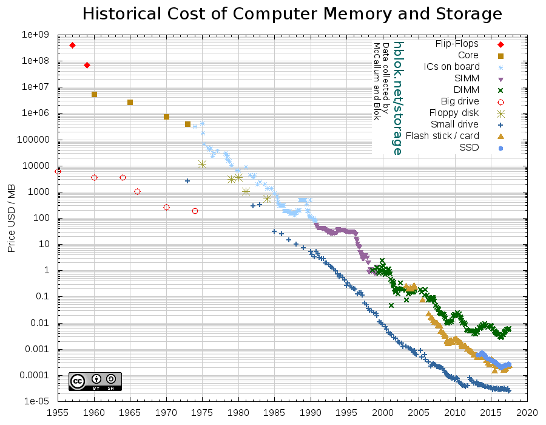

```{r setup, include=FALSE}
knitr::opts_chunk$set(echo = FALSE)
```

# Computer science survival kit

--

A computer can be abstracted by four key components:

--
- processing (FR: processeurs)

--
- memory (FR: mémoire vive)

--
- storage (FR: stockage)

--
- wiring / network (FR: connexions / réseau)

???

Ask audience

---

background-image: url(img/processors/cpu.jpg)
background-size: cover

---

## Processors

???

The processor is the unit responsible for performing the actual computing.

A processor can be called a "core", a "chip"... and can be differentiated into CPU (central processing units), GPU (graphical processing units) and recently TPU (tensor processing units).[^1]

[1]: Formally, the chip is the physical device, and a chip may enclose one or more logical processors, called cores, in its electronic circuits. Multiple CPU cores on the same die share circuit elements, use less energy, exchange information faster (individual signals can be shorter, degrade slower and do not need to be repeated as often).

A processor performance is measured in how many operations it can perform per second, typically measured in FLOP (floating-point operations per second).

---

## Processors

**What is important for us to know?**

--
- computation happens **_physically_** in **transistors**

--
- **programs must be converted to machine-code**, i.e. to a list of formatted instructions that the processor can execute

--
- **instructions are stored sequentially** in one or several stacks / threads / queues

--
- multiple processors or cores may share a stack, or have each their own
--
- **processors can be specialized** (e.g. GPU)

--
- performance is measured in number **operations** or **instructions per second** (FLOPS, IPS)

???

- the elementary computation (addition, multiplication...) happens through a **physical** process
- in order to perform higher-level operations (the source code), instructions must be converted to more basal units of computation (the machine code)
- the low-level instructions are stored sequentially in a stack or thread
- processors draw from the stack ; multiple processors may all draw from the same stack (multi-tread architecture), or on the contrary have each their own (single-thread)
- processors can be hard-wired to specialize into doing some types of computation, this is the case of GPUs and TPUs

---


.footnote[**Source:** Kurzweil ([link](http://www.kurzweilai.net/exponential-growth-of-computing)) via Our World in Data ([link](https://ourworldindata.org/technological-progress))]

???

Processors have made incredible progress over time. And this keeps happening.

---

.height600[]

---

.height600[]

???

"Law" by 1965 by the Intel co-founder Gordon E. Moore.

---

## Processors

**Processing is a limitting factor.**

- processors are **the most expensive part** of the hardware
- energy consumption of the processors are the **main cost of computation**
- one core can **only** perform **so many operations** per second
- it is **non-trivial** problem to **coordinate multiple processors** on the same complex task

???

You can not just "buy more cores" to tackle a problem that takes too long.

---

background-image: url(img/ram.jpg)
background-size: cover

---

## Memory

???

Memory is the unit where the computer temporarily stores the instructions and the data on which to perform computation.

It is also broadly called "cache" or "RAM"[^2].

Memory efficiency is measured by how much information it can contain and how fast in can be read from or written to.

---

## Memory

**What is important for us to know ?**

--
- moving data around takes time

--
- memory is **fast** (ns)

--
- memory is **volatile** (lost in case of power interruption)

--
- memory-processor units are **heavily** optimized

--
- processors always access the the hard disk through **memory caching**

???

What is important to know for us:
- memory is fast, with access time typically measured in nanoseconds
- memory is volatile, meaning that it is lost in case of power interruption
- the easiest way to perform a computation is to move all data in memory — where it becomes accessible to the CPU

---

.height600[]

---

## Memory

**Memory is a limitting factor.**

- it is non trivial to work with data that **can't fit into memory**
- memory is **the second-most expensive part** of a computer
- memory is **shared** with other programs on the computer

???

We can readily perform computation only on a chunk of data that can fit into memory. RAM is very costly: it is still expensive to buy RAM but it is also expensive at use time since it needs electricity to persist data.

<!-- graph of the veolution of memory size -->

[2]: Formally, there is intermediate memory between RAM and the processor: the CPU register is closest to the processor, then comes the CPU cache, on which the computer moves data and instructions that need to for efficiency reasons. "Caching" in general refers to the act of copying a piece of information closer to the place it will be used, such as when storing a local copy of website while navigating over the Internet. RAM (random access memory) is the most-used type of memory.

---

background-image: url(img/storage/storage.png)
background-size: contain

---

## Storage

- for long-term storage of information

--
- can have **multiple forms**: magnetic disk (hard disk, floppy disk), physical engraving (vinyls, CDs, DVDs), magnetic tape, paper (books, punch cards, bar codes, QR codes), biological (DNA), etc.

--
- commonly referred to as "(disk / storage) space" or "(hard) disk"

--
- **non-volatile**, contrary to memory

--
- valuable properties:
    - **size**
    - **integrity**, resistance to degradation
    - **speed**, in read and write

.footnote[The memory (RAM) vs. storage (hard disk) distinction is pedagogical. There are many in-between technologies, such as solid-state drives (SSD).]

???

Storage is the unit for long-term storage of information.

It is also called "(disk) space" or "(hard) disk".

Contrary to memory, the disk's non-volatile nature make it suitable to conserving information over long periods. Its first measure of efficiency is thus its size, how long it can retain information without error and how fast you can read from and write on it.

There are other meda of storage, such as... paper, but also digital tapes.

In reality the distinction memory vs. storage is more of a continuum. For instance, SSD disks are faster to read but more expensive to produce.

---

## Storage

Storage is evaluated in **bytes** (B) or **octets** (o) and their mutiples:

| Number of bytes | Symbol | Full name | Order of magnitude |
|---------|----|------------|------------------|
| $10^3$  | ko | kilobyte   | a vectorial icon |
| $10^6$  | Mo | megabyte   | a high resolution image, a book |
| $10^9$  | Go | gigabyte   | a high-resolution video
| $10^{12}$ | To | terabyte   | the whole Friends series in high-resolution |
| $10^{15}$ | Po | petabyte   | Spotify database |
| $10^{18}$ | Eo | exabyte    | monthly Internet traffic |


.footnote[

Since $2^{10}=1024 \simeq 10^3$ and since storage is essentially binary, you often find the convention $1 \text{Mo} = 2^{10} \text{ko}$. The official symbols $\text{Kio}$, $\text{MiB}$... never really caught on.

]

---

.height600[]

---


.height600[

<a href="https://www.statista.com/statistics/795748/worldwide-seagate-average-hard-disk-drive-capacity/" rel="nofollow"></a>

]

---

## Storage

**What is important for us to know ?**

--
- storage is **faillible**

--
- writing and reading is **slow** (ms)

--
- **data is always cached** (copied / charged into memory) for computation

???

What is important to know for us:
- storage is faillible: errors do occur and information slowly degrades (phenomenon known as data decay: https://en.wikipedia.org/wiki/Data_degradation ; solid state memory like flash card may be corrupted by current ; magnetic field can corrupt disks, tapes ; scratches and dust can corrupt DVDs ; rotting / overuse can corrupt books etc. ; keeping copies often mitigates the problem, but at the cost of maintaining coherence!)
- storage is slow, typically measured in milliseconds [^3]
- computation cannot be performed directly from disk, it has to be temporarily copied into memory (or "cached")

[3]: writing and reading on a disk requires the disk to turn and the reading head to move ; on the top of that, files are split into chunks that are stored at different places and the computer needs a registry to record where what is where

---

## Storage

**Storage is a limiting factor.**

- on a given computer, **you can only store so much**

--
- dealing with **files distributed over multiple computers** is non-trivial

--
<br>Cost and speed are usually not an issue.

???

On a given computer, we can only store so much. Today's price of disk space does make it less limiting economically. But if data exceeds the size of the disk, data must be split between several disks, which complicates programming (**distributed storage**).

<!-- average storage capacity ; graph of information degradation over time -->

???

2 more things before we move on: network and compilation / intepretation

---

## Network

- information transfer is **time-consuming**
- usually not an issue on a personal computer:
    - processors and memory are **closely integrated** in the same circuits
    - physical connection between memory and disk is **short** and **fast**

- becomes an issue with **remote** (or **distributed**) storage (or computing)

---

## Network

For transferring volumes above 1 Po (1000 To) to their servers, Amazon actually sends a truck, which is faster than a fast Internet connection.

.height400[]

<!--

## Interpreting vs. compiling

???

When running a programme written in R or Python, the **source code** is translated into **machine code**.

There are schematically 2 ways to do that:

When **interpreting** the source code, instructions from source code are converted **one by one** into machine code. Say you have an error in your code at line 10. Your programme would execute the first 9 lines then halt with an error.

When **compiling** the source code, instruction from source code are converted **as a whole** into machine code, while performing many optimisation procedures under the hood (ex: multiplying by 2 is just adding an extra 0 to the right in binary ; also you may want to take advantage of the processor pipeline, i.e. the fact that reading the next task from memory can be made to happen *in the same time* than execution of the preceding task). This means that your code with an error would just fail compiling and that "the beginning" (which does not even make sense anymore) will never be executed. Compilation takes time, but it may be worth it if the same programme is run regularly.

Real-world computing is not black and white. For instance most interpreters do perform optimisations on the fly, even though not as thorough as compilers. A common intermediate pattern is **compilation to bytecode**, a platform agnostic language that gets interpreted at run time, or even further compiled to machine code.


## Making of Computer Science survival kit

### Brainstorm of themes

- [ ] Code profiling to prioritize optimization. Do not spend time to reduce the computation time of a function by 0.5 sec if another function take 10min. Try to optimize the slowest part of your code. 

  - [ ] Python profiling : `cProfile`. Give a lot of information, maybe too much. You have to filter to get only the high level function. An easier solution is to use `time.time`. You could use `timeit`, but it's a bad idea. `timeit` is for benchmarking, not profiling.

    ```python
    import time
    import cProfile
    import pstats
    from pstats import SortKey
    #----------------------------------------------------------------------
    def fast():
        """"""
        print("I run fast!")
        
    #----------------------------------------------------------------------
    def slow():
        """"""
        time.sleep(3)
        print("I run slow!")
        
    #----------------------------------------------------------------------
    def medium():
        """"""
        time.sleep(0.5)
        print("I run a little slowly...")
        
    #----------------------------------------------------------------------
    def main():
        """"""
        fast()
        slow()
        medium()
        
    if __name__=="__main__":
        
        cProfile.run('main()', 'restats')
        p = pstats.Stats('restats')
        p.sort_stats(SortKey.TIME).print_stats(10).print_stats('profiling.py')
    ```

    

- [ ] Good programming practices/tips :
  - [ ] Python :
    - [ ] Multithreading/multiprocessing are not so hard if the processes are independents
    - [ ] Use queue to pass data from one thread to another
    - [ ] Do not append to pandas dataframes ! Append to list then generate a DF from it
    - [ ] Open your resources once !
  - [ ] Do I really need all those 150 columns  ?
  - [ ] Filter before any computation
  - [ ] Proceed a very large dataset but I have independent problem ? Parallelization 
  - [ ] On big request to a db is better than 1000 small. Even the smallest request take time. This time cannot be reduce, so small time * 1000 = not so small time.
  - [ ] Do not download data If you do not need them. For example if your data are on a distance server, run the computation on the server THEN download the result. If you download the data on your computer then run the computation :
    - [ ] The downloading slow down the process
    - [ ] Your computer is likely to be less powerful than the distant server.
  - [ ] Low level language (like C/C++) are faster than high level one (python, java, R). But, there are more difficult to learn and usually code optimization is enough. But for easy tasks, knowing a little of bash is a good thing.
  
- [ ] awk (pronounced *hawk*) : super fast line by line processing unix command.


- [ ] Extract a max from gzip fixed length file. Awk is around two time faster than python. If we parallelize python it become faster than awk, but parallelized awk is still two time faster than parallelized  python. It's not really "big data processing" but for large, but not big data large file, there is simple way to speed up the process. Here is only $\mathcal{O}(n)$ process 
|                     | Small sample (30 files, 4.8 Mo) | Bigger sample (41 files, 1.2 Go) | Even bigger sample (48 files, 3Go) |
| ------------------- | ------------------------------- | -------------------------------- | ---------------------------------- |
| awk                 | 0.23 sec                        | 35 sec                           | 101 sec                            |
| awk parallelized    | 0.07 sec                        | 8 sec                            | 18 sec                             |
| python sequential   | 0.45 sec                        | 77 sec                           | 174 sec                            |
| python parallelized | 0.24 sec                        | 17 sec                           | 40 sec                             |

benchmark done with a :

- 12 logical core
- 16 Go Ram 
- Ubuntu 16.04

- [ ] Keep in mind some common bottlenecks :

  - [ ] Read/write from disk. A common HDD 30-150 MB/sec, SSD 500+ MB/sec. So switching to SSD can improve performances. Your disk are a bottleneck only when you use it a lot.
  - [ ] Network. Transfer very large data through a network take time. So just get what you need
  - [ ] CPU. You are doing to much computations, and your CPU are at its max capacity. No easy solution here. Parallelization, approximation, GPU are leads
  - [ ] Memory bottleneck. You do not have enough RAM -> crash. Increase your RAM, or be smart

  You can monitor your system with tools like windows tasks manager.

### Documents

A checkmark means that the the source has been read and its content has been extracted in the brainstorm section.

**Wikipédia:**

- [ ] awk : https://en.wikipedia.org/wiki/AWK

**Other websites:**

- [ ] Python profiler : https://docs.python.org/3/library/profile.html
- [ ] https://www.blog.pythonlibrary.org/2014/03/20/python-102-how-to-profile-your-code/
- [ ] https://towardsdatascience.com/finding-performance-bottlenecks-in-python-4372598b7b2c

**Books:**

- [ ] Hadoop the definitive guide (Chapter 2, analysing data with unix tools)

**Courses:**

- [ ] A course

### Structure

-->