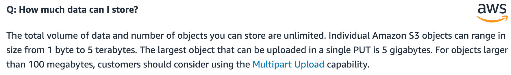
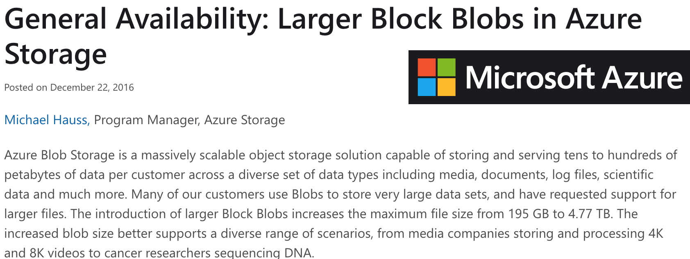

```{r setup, include=FALSE}
knitr::opts_chunk$set(echo = FALSE)
```

## What if ... ?

???

We have to distinguish between estimation of a statistical model (always the same call, happen seldom, often only once or twice), developement/research (many requests, often very different from each other) and model in production, for instance for prediction (usually lighter computations, but happen possibly very often). It is rare to be in the case where you both want a very intense computation and you wan to perform it often, exceptions being for instance 3D rendering.

---

## What if data is too big to fit in memory ?

.pull-right[]

--
1. Buy more/bigger  </br>
--
Easy but expensive. Not the best solution

--
2. Do less (filter, select, sample) </br>
--
Do you really need all this data ? Can statistic help you ?

--
3. Do things in chunks / stream </br>
--
Need to rethink the process. Or to use exotic libraries 

--
4. Distribute the data </br>
--
Go to the cloud, or use a Spark cluster, use in DB processes ...

---

## What if ... ?

---

## What if your file is too big for your local file system ?

.pull-right[]

--
1. Update file system </br>
--
No more FAT32

--
2. Import less data (filter, select, sample)</br>
--
For a small experimentation, you don't need 2To of data

--
3. Cut file into pieces and process in chunks<br><small>for instance 1 file per day</small>

--
4. If you file is slight structured, go onto databases, that's what they are made for

--
5. Rent a remote cloud-based service, they will abstract the problem away from you</br>
--
Like AWS S3, Azure Bloc Blobs 

???

Sometimes you don't have the choice. You get data you have to read before you can filter.

---

## What if your file is too big for your local file system ?



---

## What if your file is too big for your local file system ?



---

## What if your file is too big for your local file system ?


---

## What if ... ?

---

## What if data is too big to fit on disk ?

.pull-right[]

--
1. store less (filter, select, sample)

--
2. buy bigger physical disk

--
3. buy your own storage server

--
4. rent storage space (file space or database) in the cloud

--
5. distribute data yourself on several nodes in a cluster

???

Database may be helpful, but won't solve the issue of not enough space on the disk.

---

## What if ... ?

---

## What if computation takes ages ?


.pull-right[]

--
1. do less (filter, select, sample), especially in development stages

--
2. do less (less tests, less formatting)

--
3. go low-level (compile, use C or C++, use command shells ... or build chips!)

--
4. profile your code (how does it scale ? where are the bottlenecks?)

--
5. buy bigger or more cores

--
6. rent cores on the cloud

--
7. avoid i/o or network operations

--
8. **parallelise on non-local nodes**

]

---

## What if ... ?

---

## What if computation / storage is too expensive ?

.pull-right[]

--
1. store or compute less (filter, select, sample)

--
2. consider cloud computing<br><small>Not always cheaper, though!</small>

--
3. be careful with databases requests

--
4. go from RAM (expensive) to disk (cheap)

--
5. use smaller but many computing units (ex: scientific grids)

???

4. stream, caveat: more communication between disk and memory

---

## What if ... ?

---

## What if data i/o is too fast ?

.pull-right[]

--
1. for computing: pipeline (overlapping chunk processing), stream (never-ending one-by-one processing)

--
2. for storage: fast databases

---

## What if ... ?

---

## What if data i/o is too varied ?

.pull-right[]

--
1. dedicated file systems and databases

This is ultimately not a computation issue.