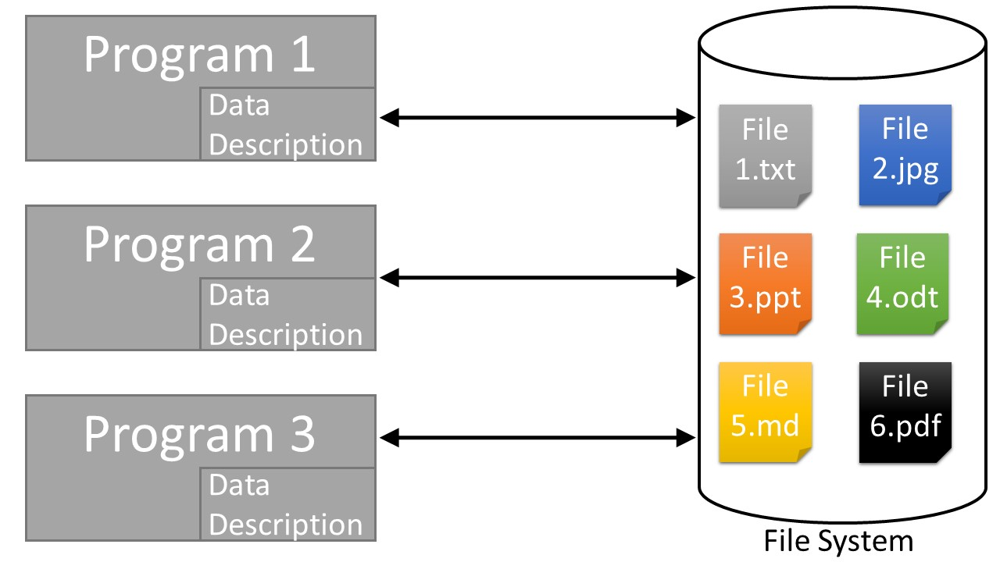
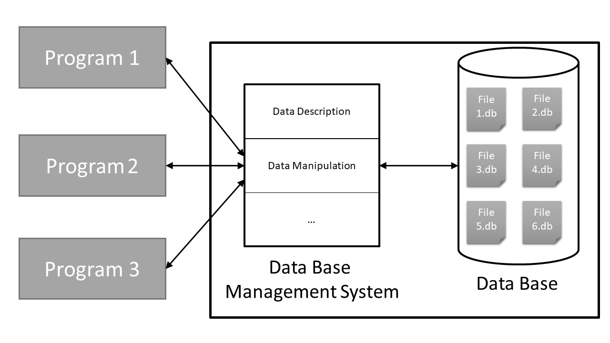
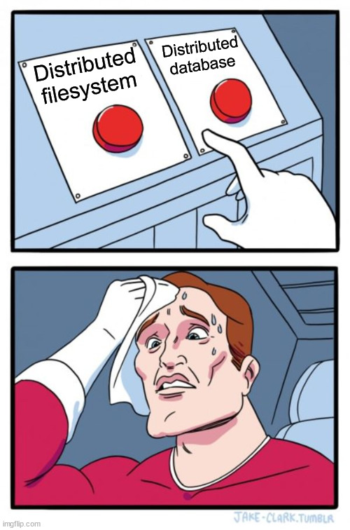

```{r setup, include=FALSE}
knitr::opts_chunk$set(echo = FALSE)
```

## Storage cost


---

## Storage on a machine


---

## Data production
.pull-left[
<a href="https://www.statista.com/chart/17518/data-created-in-an-internet-minute/" title="Infographic: A Minute on the Internet in 2020 | Statista">
</a> You will find more infographics at <a href="https://www.statista.com/chartoftheday/">Statista</a>]

.pull-right[
There are no way that any of those app can store all these data on one single machine

They all need distributed storage !
]

---

## How to store data ?

There is two way to store data :
--

- A **file system** (like the one you use on your computer) to store *file* (unstructured higly heterogenous data)
--

- A **database** to store *formated data*

---
## File system in a nutshell

**Manages files on storage space (like hard disk)**
  - Transparent for users,they only see "file"
  - Can handle very heterogenous unstructured data
  - Only understand *metadata*


--
**Principal use cases**
  - Read / write data
  - Security
  - Good for storing, bad for processing
  
---
## Why use file system

- Because you only want to store data and do not need integrated tools
- Because your data are very heterogeneous or complex (like photo, video etc)

---

## File system in a nutshell




---

## Databases in a nutshell

**Manages files on storage space**
  - Transparent for the user, he only see "data"
  - Possibly care about data format (numbers, texts, dates...)
  - Handles *homogeneous*, *structured*<sup>1</sup> data
  
.footnote[
1 : in comparaison to filesystems
]

--

**Principal use cases**
  - Unique entry point to access data
  - Knows how to read/write data
  - Exposes tools to manipulate data (like SQL)
    


???
Even if unstructured databases exist, the data in a DB are more structured than a file system

---
## Databases in a nutshell


---

## Why use a database ?

- Because you need some integrated tools to manipulate your data
- Because your data are database ready

---
## Not so simple

Since 2000 the difference became blur between file system and databases (Nosql Movement)

> The difference between a distributed file system and a distributed [database] is that a distributed file system allows files to be accessed using the same interfaces and semantics as local files.


--
So FS and DB will have the same issues to tackle

---

## Distribution : unlimited storage ?


---

## The fundamental problems of distribution


- **Availability:** you want your data available 24/7

--

- **Consistency:** the same query with the same data return the same result

--

- **Partition tolerant:** the system can deal with some failure


---

## The fundamental problems of distribution


Plus the usual questions of large-scale systems :

- **Confidentiality:** only authorized person can access your data
- **Data governance:** under which law are your data ?
- **Environment:** is your system not too big ? Does your system use too much energy ?
- **Economy:** isn't it too expensive to manage?
- ...


---
## The CAP theorem


???

Brewer's theorem, published as a conjecture in 1999, proved in 2002
Source : https://en.wikipedia.org/wiki/CAP_theorem

---
## The fundamental problems of distribution

### Some solutions 

--
- **Redundancy / replication:** keep copies of the data in far away nodes, so that you don't lose information under hardware failure 

--
- **Balancing\rebalancing:** use all your node fairly 

--
- **Timestamp-based concurrency control:** use timestamp to resolve conflict (first in first out)  

--
- **Get the closest data to the client:** if the data are close to the client, there is less network time 

--
- **Have a main node:** it organizes the work to avoid conflict 

--
- **Asynchronous processing:** nodes can accept change locally, and consolidate the transactions only in a second phase 

--
- **First-class actions:** you may chose to priviledge reads over writes, or to completely prevent modifying files, for instance 
???


In this part we do not distinguish between file systems and databases.

Homegeneous (all run with the same sowftware / OS) vs. inhomogeneous (diff. software / OS).


> Confidentiality, availability and integrity are the main keys for a secure system.

> A server belongs to a rack, a room, a data center, a country, and a continent, in order to precisely identify its geographical location
> The need to support append operations and allow file contents to be visible even while a file is being written
> Communication is reliable among working machines: TCP/IP is used with a remote procedure call RPC communication abstraction. TCP allows the client to know almost immediately when there is a problem and a need to make a new connection.

**Source:** https://en.wikipedia.org/wiki/Distributed_file_system_for_cloud


> Distributed file systems may aim for "transparency" in a number of aspects. That is, they aim to be "invisible" to client programs, which "see" a system which is similar to a local file system. Behind the scenes, the distributed file system handles locating files, transporting data, and potentially providing other features listed below.
> 


---
## Transparency requirements


Because distribution is a tehcnical solution, it must be transparent for users :

- **Access transparency** : unaware of distribution
- **Location transparency** : unaware of the physical location
- **Concurrency transparency** : all client should see the same state

---

## Some big data storage solution

### File system/Object storage

- [Hadoop File System (HDFS)](https://hadoop.apache.org/docs/stable/hadoop-project-dist/hadoop-hdfs/HdfsDesign.html) : open source distributed file system. Part of the Hadoop Ecosystem
- [Minio](https://min.io/) : open source object storage
- [Amazon S3](https://aws.amazon.com/fr/s3/) / [Google Cloud Storage] : objet storage as a Service

---

## Some big data  storage solution

### Databases

-  [MongoDB](https://www.mongodb.com/fr) : document oriented
-  [Amazon DynamoDB](https://aws.amazon.com/fr/dynamodb/) / [Azure Cosmos DB](https://azure.microsoft.com/fr-fr/services/cosmos-db/) / [Google Firestore](https://cloud.google.com/firestore?hl=fr) : document oriented as a service
-  [Google Bigtable](https://cloud.google.com/bigtable/?hl=fr) / [Amazon Redshif](https://aws.amazon.com/fr/redshift) : column-oriented as a service
-  [Cassandra](https://cassandra.apache.org/) : column-oriented

---

## How to choose ?

.pull-left[]


.pull-right[
Not a simple answer.

- if you just want to store data for later : filesystem
- if you have highly heterogenous data (image + text) : filesystem
- if you need integrated tools to request data : database
- json, xml processing : database or filesystem 


Maybe you need a file system to store raw input data, and a database to store the cleaned data
]


---
## To sum up

- Difference between filesystem and database is very blur
- Lot of highly specialized tools. You have to pick the better one for your need
- Big data solution are not always needed.

---
