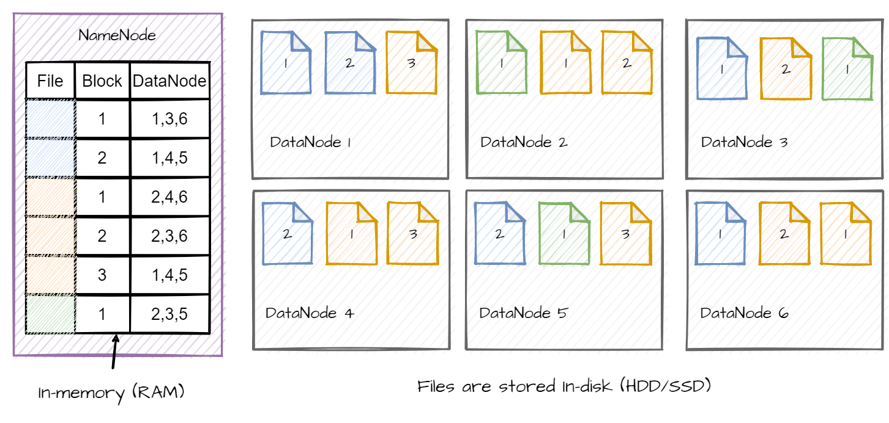

```{r setup, include=FALSE}
knitr::opts_chunk$set(echo = FALSE)
```


## HDFS in a nutshell

- A widely use distributed file system
- The default storage layer of the the Hadoop Ecosystem
- Write once, read many philosophy
- Can store *very large file* 


---
## The Hadoop Ecosystem


---

## A little bit of Hadoop history

- 2003 Google release a [paper](https://research.google/pubs/pub51/) about their Google File System (GFS) (Storage)
--

- 2004 Google release a [paper](https://research.google/pubs/pub62/) about processing data on large cluster (MapReduce)
--

- 2006 first release of Hadoop 0.1.0. Open source implementation of GFS and MapReduce
--

- 2011 release of Hadoop 1.0.0
--

- 2013 release of Hadoop 2.2.0 (first sable version of 2.x) (resource management layer)
--

- 2017 release of Hadoop 3.0.0
- 2021 release of Hadoop 3.2.2 (still an active project)

---

## Why use Hadoop ?

- Open-source financed by the Apache Foundation
- Well spread
- Well documentation
- Lot's of related projects (Spark, Hive, Solr, Kafka)

---

## The HDFS architecture

### Architecture

 Main/workers architecture

- **NameNode** (main): manage the file system. Doesn't store any file. It store *on disk* only the namespace image and edit logs. It keep in *memory* the physical location of the data block.
- **DataNode** (worker): workhorse of the system. They store and retrieve blocks when they are told to.

---

## The HDFS architecture

### How does it work ?

- Each file are split in **block** (128 Mb by default).
- Those blocks are stored inDataNodes. To provide high reliability, each blocks are stored on multiple (3 by defaults) DataNode.
- The NameNode keep in memory how each file is splited and where each block is stored.

---

### How does it work ?



---

### How to get a file ?

- A client requests a file to the NameNode 
- The NameNode selects for each file block a DataNode
- It sends back to the client where to find each block
- The client request the DataNode

--

**Pros**: 

- No network nor process overload for the NameNode
- The NameNode can handle a lot of request at the same time 
- Try to select the best DataNode

--

**Con**:

- NameNode single point of failure (there is solution)

---
## How to use HDFS ?

- You need a cluster with HDFS to store file (obviously) 
- HDFS doesn't provide a fancy GUI to interact with  :
  - Install the hadoop CLI on your machine
  - Use the Java API 
  - Use the [WebHDFS REST API](https://hadoop.apache.org/docs/r2.4.1/hadoop-project-dist/hadoop-hdfs/WebHDFS.html)
- Install HUE, an GUI for the Hadoop ecosystem


---
## Pros of HDFS

- Fault tolerance :
  - Resilient to DataNode failure
  - NameNode failure can stop the system for some time, but if the log and the namespace image are still here the system can reboot (that's why they are persist on disk)
- High throughput
- Scale easily
  - Just add mote DataNode for more storage capacity
  - For very large system one NameNode can be insufficient 

---

## Cons of HDFS

- High latency data access
- Can't handle lots of small file
- No concurrent write for the same file
- No arbitrary modification of a file. Can only add content at the end

---
## When HDFS is a good choice ?

- To store very big files
- To store read only files
- To build all the Hadoop stack on top
- To store file for batch processing

---
## When HDFS is a bad choice ?

- To store a lots of small files
- To store files that are edited a lot
- To store file used by system which need low latency

---
## Keep in mind

- HDFS is only a storage solution !
- There is a framework to process the data called **MapReduce**
- HDFS doesn't have a GUI, it's all command line (CLI)
- [HUe](https://gethue.com/) can provide a nice GUI