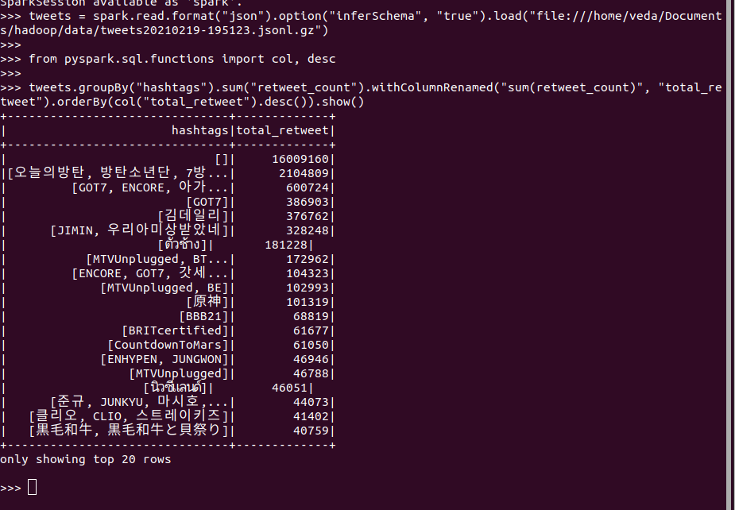
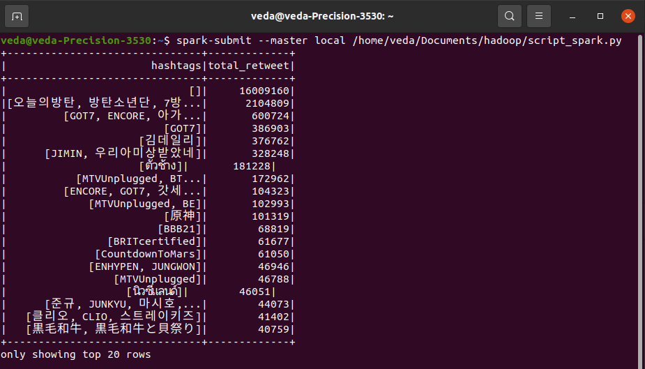

```{r setup, include=FALSE}
knitr::opts_chunk$set(echo = FALSE)
```


## Spark in a nutshell

- A widely use computing engine
- *"In memory MapReduce"*
- Python and R friendly
- Can process *very large file* 
- Can run without HDFS or the Hadoop ecosystem


---
## The Hadoop Ecosystem


---

## Common Spark APIs

--
- Scala (the default one)

--
- Java

--
- **Python** ([pyspark](https://spark.apache.org/docs/latest/api/python/))

--
- **R** ([SparkR](https://spark.apache.org/docs/latest/sparkr.html), [sparklyR](https://spark.rstudio.com/))

--
- **SQL** ([Spark SQL](https://spark.apache.org/sql/))

---

## Key Concepts

### Architecture

Main/workers architecture<sup>1</sup>

- **Driver** (main): maintains information about the Spark Application,
responding to user's program, analyze, distributes and schedules works.
Can be your own computer in *client-mode* or a server in *cluster-mode*.
If the driver fails, everything fail
- **Executors** (workers): workhorse of the system. Keep data in memory and 
do the computation. If on top of HDFS, executors and datanodes are running on 
the same machine. If some executors fail, just need some recomputation

.footnote[1:The real architecture is more complex because of the Resource Management Layer]

---

## Key Concepts

### In memory data

- Spark keeps data in memory (RAM) (like R or Python)
- Spark is a distributed system

--

So your data are not in only one machine ! They are spread among your cluster, **WITHOUT REPLICATION**

???


---


## Key Concepts

### Dataframe

- Spark manipulates **tabular data** :

--

  - Fixed number of typed columns (schema)
  - Every line must have a value for every column (`null` is ok)

--

- A DF is spread among your cluster

--

- You manipulate the DF like it's only in one machine

--
- **A DF is immutable (you can't modify it once it's created)**

---


class: center, middle


---

## Key Concepts

### Transformations and Actions

- Spark has two types of methods :

  - **Transformation** : takes a dataframe as input and produces another dataframe as output
  - **Action** : takes a dataframe as input and writes it to output data sources (console, file)


---
## Key Concepts

### A transformation flow

```python
# read file
flightData2015=spark.read.format("json")
  .option("inferSchema", "true")
  .csv("file://2015-summary.csv")

#process  file, chaining transformations
df = flightData2015.groupBy("DEST_COUNTRY_NAME")
  .sum("count")
  .withColumnRenamed("sum(count)","destination_total")
  .sort(desc("destination_total"))
  .limit(5)

# Print data in console, action
df.show()
# write date in file, action
df.write.format("csv")
  .save("file://output")
```

---

class: center, middle


Example of a dataframe transformation flow

---
## Key Concepts

### Lazy evaluation

Wait the very last moment to process computation. You manipulated "hollow" dataframe

--

Writing a **transformation** don't run any computation.

--

You chained **transformations** to design your process. And you use an **action** to run it.

---

## In a nutshell


---

## Key Concepts

### Transformations

Some common transformations :

- `df.map()`/`flatmap()` : applies a function to each row
- `df.filter()` : filter rows 
- `df.select()` : select columns
- `df.selectExpr()` : run `SELECT` SQL statement 
- `df.union(otherDataframe)`: return a dataframe with the union of the element of the source and the argument
- `df.distinct()` : Return a new dataframe that contains the distinct elements of the source dataframe
- `df.groupby()` : group a DF by a criteria
-  `df.sum()`/`avg()`/`mean()` : if grouped DF return one line by group

???
- map : one row = one row
- flatmap : one row = multiple row
---

class: center, middle


---
## Key Concepts

### `sql()` : one transformation to rule then all<sup>1</sup>

.footnote[
1 : not all it's just for the dramatic effect
]

Spark understands sql statements !

--

```SQL
spark.sql("""
	SELECT user_id, deartement, first_name
	FROM professors
    WHERE departement IN
    	(SELECT name FROM departement WHERE created_date >= '2016-01-01')
	""")
```


---
## Key Concepts

### `sql()` : one transformation to rule then all

Pros :

- Easy to understand
- Return a DF so you can chain it with another transformation
- One of the most powerful feature of Spark

--

Cons :

- Can't do everything with SQL

---

## Key Concepts

### Actions

Trigger computation. So they take time !

--

Common actions :

- `df.show(n=20)` : print the first n row
- `df.count()`: return the number of line in the dataset
- `df.take(n)`: return the first n rows as `list` of `Row`
- `df.write.format().mode().save()` : write the DF to file

---
## Importing data

Natively Spark can handle :
- CSV files
- JSON files
- Plain-text files
- Databases connections
- Data stream


Can handle compressed files too


???
There is other datasource maintained by the community


---
## Importing data

Always the same basic layout

```python
df = spark.read.format(file_format) #csv, json
  .option("mode", [permissive(default), dropMalformed, failFast]) 
  .option("inferSchema", [True/False(default)]) # read some reccord and infer the schema
  .option("path", "path/to/file") # for local file begin with file://
  .schema(someSchema) #if you didn't infer it
  .load() #lazy operation
  
df.show()#to print the first 20lines
```


---
## Importing data

To read a gzip csv file with an header, letting Spark inferring the schema, and failling if
there is one bad reccord

```python
df = spark.read.format("csv")
  .option("mode", "failFast")
  .option("header", "true") 
  .option("inferSchema", True) 
  .option("path", "file://path/to/file.csv.gz") 
  .load() 
```

---
## Importing data

To read a csv file without an header, giving Spark the schama, and accepting bad reccord

```python
from pysark.sql.types import StructField, StructType, StringType, LongType
schema = StructType([
  StructField("col1", StringType(), True),
  StructField("col2", StringType(), True),
  StructField("col3", LongType(), True)
])

df = spark.read.format("csv")
  .schema(schema)
  .option("header", "false") 
  .option("path", "file://path/to/file.csv") # for local file begin with file://
  .load() 
```

---
## Importing data

To read a json file inferring the schema and accepting bad reccord

```python
df = spark.read.format("json")
  .option("inferSchema", "True")
  .option("path", "file://path/to/file.json") # for local file begin with file://
  .load() 
```

---
## Exporting data

Always the same basic layout

```python
df.write.format(file_format) #csv, json
  .mode([append/overwrite/errorIfExists(default)/ignore]) 
  .save("path/to/folder")
```

--
By default, each **executor** write their partition in a different file. 100 executors = 100 files.

--

`.coalesce(1)` is a workaround but on very large data won't work.


---

class: center, middle


???

coalesce(1) gather all the partition on one executor. No more parallelization. And you executor have to deal with a lot of data

---
## What if spark wasn't lazy ?

- Each line of code could take ages to compute

--
- Users do not optimize their code (*filter data at the end*)

--
- Each transformation produce a DF. 10 transformations = 10 DF

--

Only users can optimise the process

???

if one DF takes 10 To of memory, 10 DF ~ 100 To ...


---
## Knowledge is power

--
- Spark optimizes your transformations chain because it knows all your transformations
(*execution plan*)

--
- Spark can snow its plan with `df.explain()`

--
- Does not keep useless data in memory (better use of memory)


???
Postgres has one too

We are in a big data situation, and we do not want to keep in memory
useless data.

---
## Lazy execution : sum up

--
- Pros :
  - Spark optimizes your operations (*caralyst optimizer*)
  - Data are not kept in memory foreever

--
- Cons :
  - Cannot reuse the same DF

---
## Caching DF

Caching make it possible to store in memory or disk a DF for future reuses.

--
-  `df_to_cached.cache()` to cache a DF

--
- It's a lazy operation (cached only when computed)

--
- Very useful in a **interactive data science session** 😉😉

---

## How to run Spark ?

- Interactively :

  - `pyspark` shell
  - `SparkR` shell / R with `sparklyR`
  - Notebook
  
- Scripts :

  - Submit script with the `spark-submit` commands
  

???
- Interactively (good for prototyping script)
- Scripts (good to run production script)

---


##  Example `pyspark` shell


---


##  Example `pyspark` shell





---


##  Example `spark-submit`




---

## To sum up Spark

--
💻 Only a distributed computation engine. Work better on a cluster than on your pc 


--
👌 Lot's of easy ways to define spark process (python, R, SQL) 


--
💤 Lazy evaluation : transformations chain + action to run computation 


--
🧰 Easy to use, can be hard to install 

---

class: center, middle

