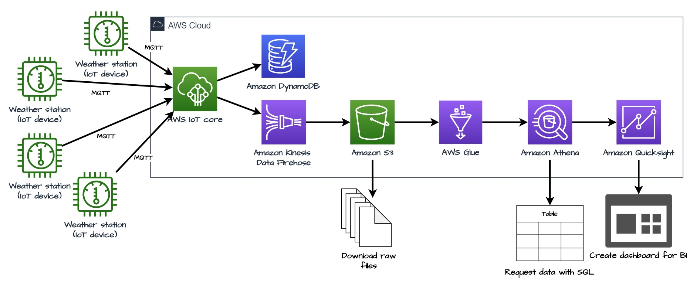
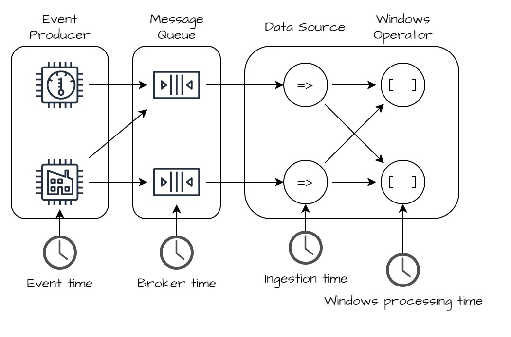
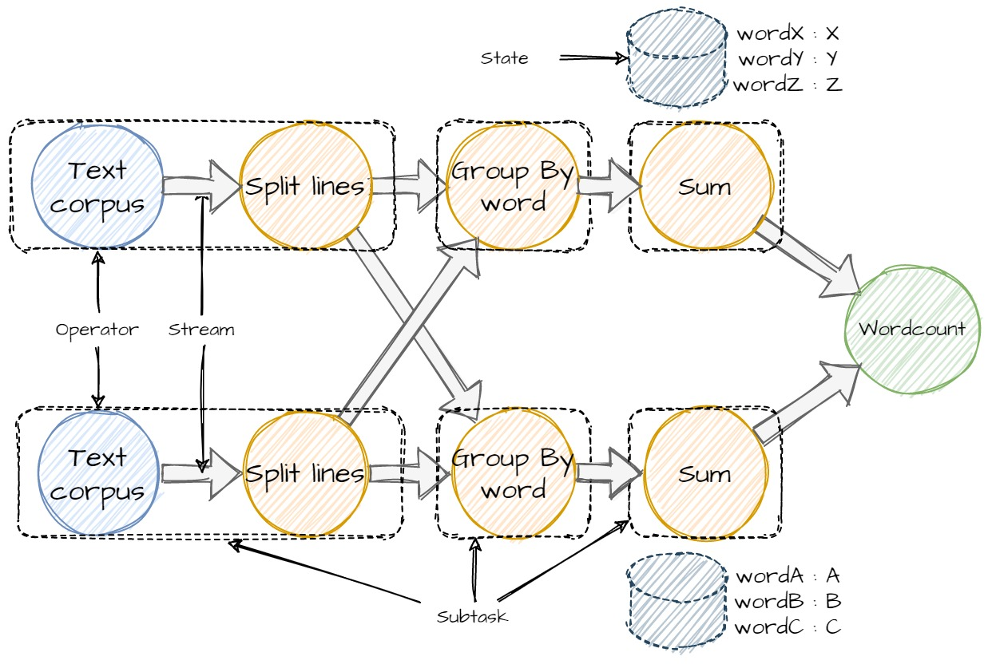

```{r setup, include=FALSE}
knitr::opts_chunk$set(echo = FALSE)
```

## What is stream processing ?

- Continuously incorporating new data to compute a result
- Unbounded data : no predetermined beginning and no end (unlike static dataset)
- New data = **event**
- No clear final result, only a result at time t
- Multiples challenges
  - High throughput
  - Keeping states for pattern detection
  - Handling machine failure

---

## Use cases

- Notification and alerting : device failure (IoT), processing command (Uber Eats)
- Real-time reporting : monitoring a system load
- Incremental ETL : every new data is process then stored
- Serve data in real time : think social network (around 6000 tweets/sec)
- Real time decision making : does this credit card transanction looks like a fraud ?
- Online machine learning : does need to retrain my model perdiodcly, it's alway learning.
---
## Stream Processing example - IoT




---
## Stream Processing example - Micro service architecture


---
## Keeping knowledge of the past : states

- **Stateless stream processing** : process only one individual event at a time, like an events parser

- **Stateful stream processing** : need more than one event to compute the answer..
  - search event patterns
  - Aggregating data
  - Training machine learning model
  
--

Two types of **states**

- local states : keep in memory for low latency
- remote states : keep on distribute storage (HDFS, S3) in case of failure.

Stream processing engine use both
---
## Time topology


---
## Time topology

- **Event time** : when the event is produced. Using it increase latency because need to wait late values. But produce correct and consistent results even when dealing with out-of-order/late event

- **Broker time** : when the event is delivered to the message queue

- **Ingestion time** : when the event is delivered to your tool.

- **Processing time** : when the event is processed. No latency, but the result will be inconsistent and usually incorrect. Only for quick results that can be incorrect.

--

In most cases, only the event time and processing time are useful. 

---
## Dataflow diagram

- Graphical representation of a **flow** of data through a process
- Good tool to design stream processes
- Just a directed graph with operators (node) and data dependencies (edge)


--

Works great for **unbounded and bounded** data.

--

Seriously you should always think your data processing like that

---
## Some Stream Processing Tools

- Message brokers :
  - Kafka : Open source, pub/sub, process streams
  - RabbitMQ
  - ActiveMQ
  - AmazonMQ, GCP Pub/Sub

  
- Real time data processing tools :
  - Apche Spark Streaming
  - Apache Storm
  - Apache Sanza
  - Apache Flink
  
  

---
## Challenges of stream processing
- Processing out-of-order data (processing order != event order)
- Maintaining large amount of states 
- Supporting high-data throughput, low latency
- Process event once despite failure
- Joining with external data (static or stream)
- Writing data transactionally to output systems

--

Some streaming systems only tackle some of those challenges. You need to choose
the best one for your use case.

???
- Plus on a d'objets et plus il faudra garder de l'info. Moyenne des températures
de 100 000 objets oblige à garder des données passées
- Il ne faut pas devenir un point de ralentissement
- Quand on écrit, il ne faut plus tenir compte des données qui arrivent
mais il ne faut pas les perdre aussi.

---
## Apache Flink

> Apache Flink is a framework and distributed processing engine for stateful computations over unbounded and bounded data streams. Flink has been designed to run in all common cluster environments, perform computations at in-memory speed and at any scale.

--

In a nutshell :

- Different API to code processes
- Only computation engine
- Can keep knowledge of the past (**state**)
- Unified tool : unbounded (*stream*), bounded (*batch*)
- In-memory (but save snapshot on persistent storage)
- Scale easily !


---
## Who use Flink ?
- Alibaba : search engine, online machin learning
- AWS : Amazon Kinesis Data Analytics use Flink
- Bouygues Telecom : real-time data integration
- Criteo : time series analytic for online advertisement
- Ericsson : real-time anomaly detector with machine learning
- Lyft : processing engine for its streaming platform
- and more
.footnote[Source: [Flink website](https://flink.apache.org/poweredby.html)]


---
## Flink overall architecture

Typical main/workers architecture :
- JobManager (main) :  coordinates the distributed execution (schedule, react to failure, coordinate recovery etc)
- TaskManager (workers) : execute task in *task slots*.

---
## Flink overall architecture


---
## Flink architecture : JobManager

3 core components, each deals with a specific task :
--

- **JobMaster** : handles the execution of a *job*. Receives *JobGraph* and the job jar then converts JobGraph to *ExecutionGraph*. Requests resource to the ResourceManager, then executes and monitors the process. He isresponsible for all actions that require a central coordination such as the coordination of checkpoints

--

- **ResourceManager** : manages only the TaskManger. Creates new ones if needeed, or remove the idle ones. Flink features different ResourceManager such as Yarn, Kubernetes, Mesos, or standalone (= no ResourceManager)

--

- **Dispatcher** : provides a REST interface to submit application for execution.

--

By default JobManager single point of failure. Need ZooKeep to ensure High Availability

???
- *ExecutionGraph* : tâche qui peuvent être run en parallèles

---
## Flink architecure : TaskManagers

- Just a JVM process
--

- Offer *task slot* to run application. No CPU isolation, only for managing memory (ex : 3 slot = each use 1/3 of the memory, but Flink do not impose CPU managment)
--

- Each slot can run one or more (configurable) substasks in different thread.
  - Pros : better resource utilization, no need to calculate how many task slot need. $n_{task\_slot} = \max(parallelism)$
  - Cons : if a task slot crashes, all substasks have to be rescheduled

---
## Flink architecure : TaskManagers


---
## Flink architecure : TaskManagers


---
## It's a kind of magic

You design your process as :

---
## It's a kind of magic

Flink will execute : 




---
## Designing Flink processes

Flink offer different APIs to design processes


---
## Designing Flink processes

- **Stateful Stream Processing** : only the basic blocks. Can create complex computations, but users have to define everything. Only for Flink experts and for sophisticated processes.
--

- **DataStream API** : offer basic transformations like joins, aggregations, windows, state. Good trade off between freedom and productivity.
--

- **Table API** : streams have a schema attached (like relational databases). Give access to select, project, group by and other sql operations. If your data can be represented as table go for it.
--

- **SQL** : write your Flink process as SQL. Your are fluent en SQL and your data are table like ? It's the best tool for your !

---
## Sources and Sinks

Flink can handle multiples data sources and data sinks. Because we are in a streaming world, and Flink is only a stream computation engine sources and sinks must handle stream.


---
## Sources and Sinks

Some source and sink currently supported by Flink :

- Apache Kafka (source/sink)
- Apache Cassandra (sink)
- Amazon Kinesis Data Streams (source/sink)
- RabbitMQ (source/sink)
- Google PubSub (source/sink)
- FileSystem (POSIX, S3, HDFS) (source/sink)

> For the lab we will mock the source with static data and use the stout as sink. It's only for conveniance, it's a terrible pratice in production.

---
## PyFlink, the Flink's python API

- Make it possible to use python to design Flink processes
- Make it possible to use python libraries (Pandas, Scikit Learn) in Flink processes

--

MAIS 🌽

- Only access to the DataSream and Table APIs
- Not very well documented
- Not so easy to submit complex jobs (jars are easier to use than .py files)
--

> For the lab we will use PyFlink, for real world application I recommand learning java/scala and use basic Flink.
 
---
## DataStream API : Basic functions

- `ds.flat_map(func)` : takes one element and transforms it to 0, 1 or more
- `ds.map(func)` : takes one element and transforms it to exactly one
- `ds.key_by(func)` : groups all the elements with the same key
- `ds.reduce(func)` : apply a reduce transformation to all elements in the same group
- `ds.filter(func)` : keeps only value for witch func returns True
- `ds.window(windows_type)` : groups all the elements that fall in the same window

---
## DataStream API

```python
# Create en execution environment
env = StreamExecutionEnvironment.get_execution_environment()

# Define source
ds = env.from_source(...)


# Define operation
def split(line):
    yield from line.split()

ds = ds.flat_map(split) \
       .map(lambda i: (i, 1), output_type=Types.TUPLE([Types.STRING(), Types.INT()])) \
       .key_by(lambda i: i[0]) \
       .reduce(lambda i, j: (i[0], i[1] + j[1]))
   
# Define sink    
ds.sink_to( ...)

# Run 
env.execute()
```
---

## DataStream API :  Using states

Using some custom states require creating a custom class inheriting `KeyedProcessFunction`. Must implement 2 methods :

- `open(runtime_context)` : configure the state
- `process_element(value, ctx)`: process one element from the input stream

---

## DataStream API : Using states

```python
class Sum(KeyedProcessFunction):
    def __init__(self):
        self.state = None

    def open(self, runtime_context: RuntimeContext):
        state_descriptor = ValueStateDescriptor("state", Types.FLOAT())
        state_ttl_config = StateTtlConfig \
            .new_builder(Time.seconds(1)) \
            .set_update_type(StateTtlConfig.UpdateType.OnReadAndWrite) \
            .disable_cleanup_in_background() \
            .build()
        state_descriptor.enable_time_to_live(state_ttl_config)
        self.state = runtime_context.get_state(state_descriptor)

    def process_element(self, value, ctx: 'KeyedProcessFunction.Context'):
        # retrieve the current count
        current = self.state.value()
        if current is None:
            current = 0
        # update the state's count
        current += value[1]
        self.state.update(current)
        yield value[0], current
```